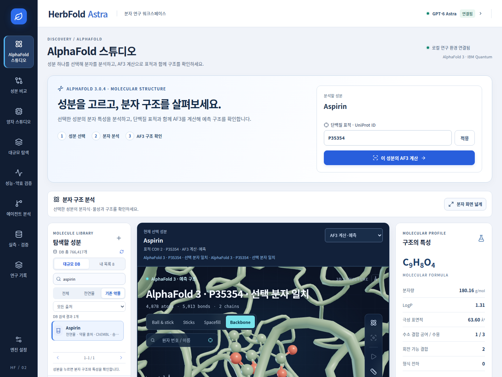
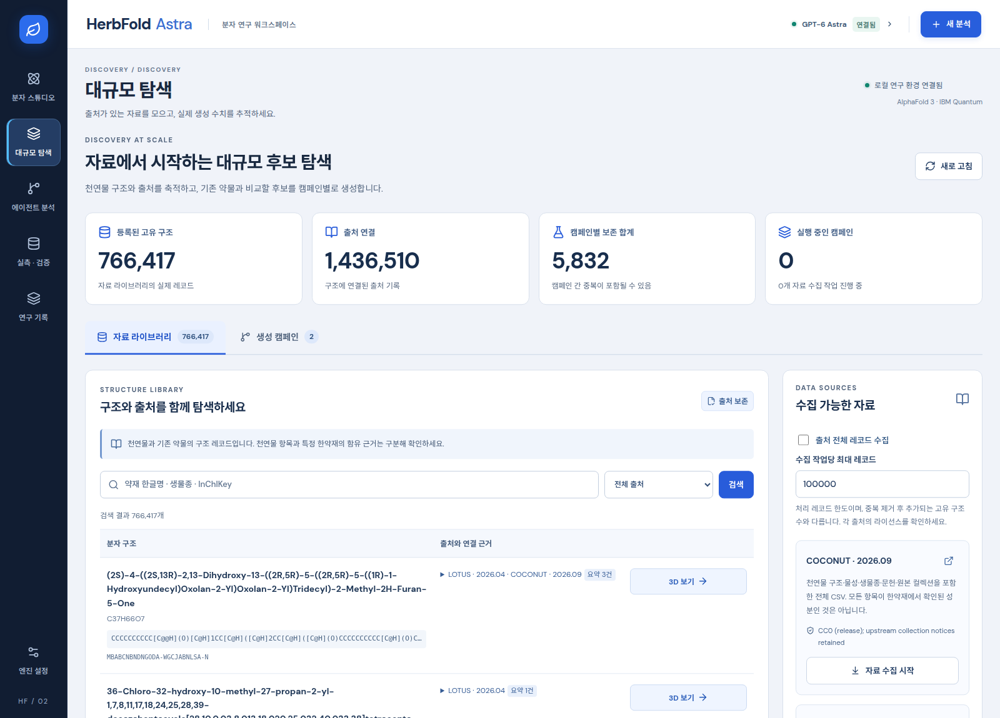

# HerbFold Astra — 양자·AlphaFold 3 연구 스튜디오

성분 하나를 선택해 분자 특성을 분석하고, 공식 AlphaFold 3로 단백질 표적과 함께 예측한 구조를 확인하는 로컬 연구 플랫폼입니다. 별도의 **성분 비교** 메뉴에서 원하는 성분들의 구조 유사도를 비교하고 후보 설계를 진행합니다. 실측 Kd/Ki 평가와 IBM Quantum 분석도 독립 메뉴에서 이용할 수 있습니다.

**현재 실행 주소: http://127.0.0.1:9018** · [API 문서](http://127.0.0.1:9018/docs)

**[AlphaFold 스튜디오](http://127.0.0.1:9018/#alphafold)**와 **[양자 스튜디오](http://127.0.0.1:9018/#quantum)**를 독립 메뉴·주소·선택 상태로 분리했습니다. 구조 쪽에서는 선택 sample의 pTM·ipTM·원자 pLDDT·방향별 PAE와 MSA 근거를, 양자 쪽에서는 입력 특징·실측 관측값·대조군·오차를 확인합니다. [스튜디오 분리·검증 보고서](docs/separate-studios-validation.md).

양자 스튜디오에 **5단계 시각 해설·실제 블록 회로 확대·XYZ 기대값 회전/줌·세 커널 비교·설명 재생**을 추가했습니다. 참고 논문의 시각 구성을 현재 저장된 회로/측정 자료에 맞춰 다시 그렸습니다. [사용 안내와 데이터 연결](docs/quantum-studio-visual-guide.md).

**기본 흐름은 성분 선택 → 분자 분석 → AF3 구조 확인입니다.** 다른 약물을 함께 선택할 필요가 없습니다. **[성분 비교](http://127.0.0.1:9018/#comparison)**에서만 여러 성분을 선택하며, 천연물끼리 또는 기존 약물끼리도 구조를 비교합니다. [단일 성분·비교 화면 검증](docs/single-compound-flow-verification.json).



새 React 19 화면에 **Motion 13, GSAP 3, Three.js, React Three Fiber 9, Drei**를 적용했습니다. 분자 라이브러리, 원자·결합 탐색, GPT-6 Astra 분석, 실측 데이터 검증, 실행 기록으로 구성됩니다. 카메라 확대·초점 이동과 UI 전환은 각각 GSAP와 Motion이 처리합니다. 일반 휠·핀치·키보드 줌, 실제 배율 표시, 분자 화면 넓게 보기와 높은 대비의 새 디자인을 제공합니다. [줌·디자인 검증](docs/studio-redesign.md).

## 대규모 탐색

**대규모 탐색** 메뉴에서 COCONUT·LOTUS 전체 공개 자료와 ChEMBL 약물 비교군을 수집하고, 한글 약재명 569개·생물종·성분·출처로 검색한 구조를 스튜디오에서 엽니다. 최대 **1억 개 목표**의 후보 캠페인은 디스크 기반 중복 제거와 배치·커서·시도/시간/저장량 예산을 사용합니다. 목표와 실제 보존 수를 구분하며, 생성된 구조는 미검증 연구 후보입니다.

현재 이 워크스테이션에는 **766,417개 구조와 1,436,510건 출처 기록**을 실제로 저장했습니다. ChEMBL 약물 비교군은 구조가 제공된 3,417개입니다. 이는 다운로드·중복 제거 결과이며 신약의 수가 아닙니다.

**AlphaFold 스튜디오 → 탐색할 성분**에서도 이 데이터베이스를 직접 조회합니다. 성분명·출처 식별자·생물종·한글 약재명으로 검색하고, 천연물/기존 약물 및 출처 필터로 좁힌 뒤 30개씩 페이지를 이동합니다. 성분 이름을 누르면 분자식·물성과 해당 성분의 구조를 확인합니다. 선택은 검색·페이지·화면을 바꿔도 현재 세션에서 유지되며, **내 목록**에서 기본 예시와 직접 추가한 성분도 다시 엽니다. **이 성분의 AF3 계산**은 선택 성분과 적용한 단백질 표적의 계산·기록으로 연결됩니다. 비교할 성분 목록은 **성분 비교** 메뉴에서 따로 선택합니다. 목록 조회나 선택만으로 AF3 계산을 제출하지 않습니다.



[수집·대량 생성 사용법과 출처](docs/large-scale-discovery.md) · [실측 검증](docs/discovery-verification.json) · [저장 계층의 규모와 한계](docs/discovery-storage.md)

## 성능·약효 검증 — 2026-09-08

**성능·약효 검증** 메뉴에서 실제 실행 결과와 후보별 근거를 확인합니다. CPU 16개 작업자로 **500만 회의 서로 다른 조각 조합**을 처리하고, 물성·중복·두 부모 계보 검사 후 **3,701,740종**을 저장했습니다. 준비 94.77초, 생성·저장 누적 활성 시간 304.34초입니다. 현재 조합 상한은 85,150,669회이므로 **1억 종 생성은 검증되지 않았으며 현재 조합 공간으로 달성할 수 없습니다.** 이 시간은 AlphaFold·QPU 추론을 포함하지 않습니다.

약효·독성 관련 계산 평가는 기존 후보 전부와 새 대규모 후보의 무작위 1만 종 표본을 대상으로 합니다. ChEMBL의 COX-2/hERG 실측 자료와 Tox21의 12개 시험으로 모델의 독립 평가·적용 범위·예측 보류를 기록합니다. 표본 밖 후보의 약효·안전성이 확인됐다고 표시하지 않으며, 어떤 후보도 임상 약효나 사람 안전성이 입증된 신약으로 판정하지 않습니다.

[최종 검증 보고서](docs/validation-report.md) · [기계 판독 결과](docs/validation-results.json) · [생성 성능 원자료](docs/scale-validation-results.json)

## 실행

```bash
uv sync --locked --extra dev
# 빌드된 UI 포함. 프런트엔드 수정 후에는 다음 명령으로 다시 빌드:
./scripts/build_frontend.sh
./scripts/run.sh
```

이 워크스테이션은 `.env`의 `HERBFOLD_HOST=0.0.0.0`, `HERBFOLD_PORT=9018`, `HERBFOLD_ALLOWED_HOSTS=*`로 실행하며 모든 IPv4 인터페이스와 접속 호스트명을 허용합니다. 공유기에서 TCP 9018을 이 컴퓨터의 `172.30.1.97:9018`로 포워딩하면 일반 인터넷에서 `http://공인IP:9018` 또는 `http://도메인:9018`로 접속합니다. 공유기의 외부 포트를 다르게 설정했다면 접속 주소에도 그 외부 포트를 사용합니다. 같은 네트워크에서는 `http://172.30.1.97:9018`로 접속합니다. `0.0.0.0`은 서버의 수신 설정이며 외부 기기의 접속 주소는 아닙니다. 화면의 **엔진 설정 → 로컬 API 인증 토큰**에 `runtime/access-token.txt`의 값을 입력하고 **연결 상태 새로 고침**을 누릅니다. 토큰은 페이지 메모리에만 보관되므로 새로 고침 후 다시 입력합니다.

공유기 포트포워딩은 사용자가 준비한 구성을 사용합니다. 특정 도메인·IP로 접속을 제한하려면 `HERBFOLD_ALLOWED_HOSTS`의 `*` 대신 허용할 호스트를 쉼표로 구분해 설정합니다. 실행 옵션 `./scripts/run.sh --host ... --port ...`은 `.env`보다 우선합니다.

현재 워크스테이션의 `.env`에는 설치한 AF3 소스/독립 Python 환경, 기존 모델 파라미터 디렉터리, GPU 선택이 설정돼 있습니다. IBM 인증은 기존 Qiskit 저장 계정을 사용합니다. 비밀정보는 소스·결과 파일에 복사하지 않습니다.

**2026-09-14 AF3 실행 조건 복구:** 장치 번호 변경을 DB 파일 변경으로 판단하던 오류를 수정했습니다. 약 911GB의 기존 파일을 전량 해시 검증한 뒤 파일시스템 UUID 기반 검증 기록으로 전환했으며, GPU 실행 사전 점검과 선택 성분의 입력 준비를 통과했습니다. [원인·복구·검증 결과](docs/af3-readiness-repair.md).

**AF3 실행·결과 갱신 수정:** 상태와 로그를 독립 조회하고, 경과 시간·연결 상태·GPU 메모리 경고를 표시합니다. 다른 진행 없이 GPU 할당 실패만 지속되면 해당 추론을 중단하고 입력과 완료된 검색 결과를 보존합니다. [이전 GPU 할당 실패와 수정 기록](docs/af3-spinner-fix.md).

**인증 재연결·구조 로딩 복구:** 연결 상태 새로 고침과 탭 복귀 시 계산 결과를 다시 조회하며, 구조 응답이 지연되면 30초 후 재시도 안내를 표시합니다. 실제 계산 단계와 화면 응답 대기를 구분하고 완료 시 측정된 소요 시간을 표시합니다. EGFR 작업의 정상 완료와 데스크톱·모바일 복구를 확인했습니다. [원인·수정·검증](docs/af3-loading-reconnect.md).

새 환경에서는 `.env.example`을 `.env`로 복사하고 경로를 설정하세요. Astra 분석에는 서버의 `OPENAI_API_KEY`와 정확한 `gpt-6-astra` 모델 접근 권한이 필요합니다. 키가 없거나 모델 접근이 안 되면 분석은 차단되며, 다른 모델로 바꾸거나 LLM을 사용했다고 표시하지 않습니다. 선택 가능한 Local 모드는 LLM을 사용하지 않는 계산 흐름입니다. 상태 점검과 네트워크 없이 실행하는 분자/로컬 양자 예제:

```bash
uv run herbfold doctor
uv run herbfold demo --output runtime/demo.json
uv run pytest -q
uv run ruff check src tests scripts
```

`doctor`는 IBM 장비를 읽기 전용으로 조회합니다. `demo`는 구조 비교·BRICS 후보·4큐빗 statevector를 실제 계산합니다. GPU 추론이나 QPU 작업을 자동 제출하지 않습니다.

## 구현 범위

| 단계 | 동작 | 산출물 |
|---|---|---|
| 성분 | 기본 예시 7종 + COCONUT/LOTUS 전체 수집·ChEMBL 비교군·PubChem 추가 | 구조·생물종·동의어·문헌·출처·라이선스·물성 |
| 대량 후보 | 최대 1억 개 목표, 디스크 중복 제거, 배치·재개·예산 관리 | 실제 생성/보존/탈락 계수, 부모 계보, 후보 JSON |
| 비교 | 성분 비교 메뉴, 2–8개 성분의 RDKit Morgan 지문·입체화학을 고려한 Tanimoto | 분류에 관계없이 선택한 모든 성분 쌍의 구조 유사도 |
| 후보 | BRICS 조각 재조합, 부모별 조각 기여 검증, 물성·QED 제한 | 두 부모 계보가 있는 후보 SMILES |
| 구조 | 공식 AF3 **3.0.4**, schema 4, native/Docker 실행 계획, 실제 GPU 실행 | mmCIF, confidence, seed/버전/해시 |
| 관찰 | Three.js/R3F 원자·결합 인스턴싱, GSAP 카메라, 실제 Cα 백본 | 원자 이웃·결합 차수·Å 거리·SDF·출처 |
| 오케스트레이션 | GPT-6 Astra 계획/조사/화학/설계/검토/보고 + AF3/양자 작업자 | 8단계 DAG, 응답 ID·사용량·체크포인트·중단/재개 |
| 실측 데이터 | ChEMBL Kd/Ki 가져오기, CSV, 원본을 보존하는 중복/assay 점검 | 검토 가능한 데이터·제외 사유 |
| 친화도 | 실측 pKd/pKi Ridge 기준 모델, 선택적 단백질·AF3 구조 특징 | JSON 모델, 예측, 적용영역 경고 |
| 양자 | 블록별 XYZ projected kernel · 기존 fidelity 호환 | 실측 특징, 대조군, 고전·정확 시뮬레이션 기준, 실제 job·shots·오차 |
| 비교 검증 | 같은 데이터 분할의 양자 KRR·고전 RBF·평균 기준 모델 | 보류 데이터 지표, 누출 점검 |
| 추적 | SQLite 상태, 작업별 입력·출력·해시, 외부 AF3 출력 가져오기 | 재현 가능한 로컬 실행 기록 |

후보 분자의 신규성은 입력 분자와 다른 구조라는 뜻입니다. 외부 화합물 DB 전체·특허 신규성·합성 가능성을 검증한 값이 아닙니다. PAINS/Brenk와 QED는 구조 경고/계산 지표이며 독성·ADMET·약효 검증을 대신하지 않습니다.

## 권장 작업 흐름

**UniProt 표적 확장:** 분자 스튜디오에서 UniProt ID를 조회·등록해 COX-2 외의 단백질도 선택할 수 있습니다. 단백질 이름·생물종·서열 길이를 확인하고 적용하면, 선택 성분과 해당 서열로 AF3 입력을 준비합니다. 등록한 표적과 작업별 서열·출처는 영구 보존됩니다. [표적 조회·등록 사용법](docs/uniprot-targets.md).

1. **AlphaFold 스튜디오 → 탐색할 성분**에서 성분 하나를 누르고 분자식·분자량·LogP·수소 결합 등 분자 특성을 확인합니다. 기본 보기는 AF3 예측이며, **자유 분자** 모드에서 실제 RDKit ETKDGv3 배좌를 확인합니다. PubChem/SMILES로 사용자 분자를 추가할 수 있습니다.
2. 단백질 표적을 적용하고 **이 성분의 AF3 계산**을 눌러 선택 성분의 입력을 준비하고 실행합니다. 작업 ID·대기열·로그·재시도·결과 선택을 지원하며 저장된 AF3 결과도 바로 확인할 수 있습니다. 공식 Google 가중치와 전체 9종 MSA·템플릿 DB를 설치했으며, 실행 전 준비 상태를 검사합니다. 기본 표준 검색은 CPU MSA·템플릿 준비 후 선택 리간드별 추론으로 이어지며 동일 단백질의 검증된 검색 결과를 재사용합니다. 구조 신뢰도와 정확도 제한을 함께 표시합니다. `MSA 없음`은 명시적으로 선택하는 탐색 모드입니다. [계산 사용법](docs/af3-calculation-workflow.md), [전체 DB 설치 근거](docs/af3-full-msa-setup.md).
3. 비교가 필요하면 **성분 비교**에서 2–8개 성분을 선택하고 **구조 비교**를 누릅니다. 같은 분류의 성분도 비교할 수 있으며, 결과는 구조 유사도를 뜻합니다. **비교 성분으로 후보 설계 · 조각 재조합**을 펼치거나 **확장 분석 설정**에서 Astra 분석을 설정합니다. 이 후보 설계 확장 기능은 천연물과 기존 약물 부모를 각각 필요로 합니다.
4. **양자 스튜디오**에서 분석별 입력·연결된 결과를 비교하거나 개별 실행 기록을 확인합니다. 양자 단계만 다시 계산할 때는 저장된 물질 순서·특징을 유지한 실행 계획을 확인합니다. 새 에이전트 분석의 IBM 장비 실행은 양자 설정에서 **IBM 최대 가용 큐빗**을 선택합니다. 기본은 로컬 4큐빗 커널입니다. 분석당 기본 한도는 8 LLM 호출·응답당 1,800토큰, AF3 후보 1개, IBM 1작업·4,096 shots·30 QPU초입니다.
5. **에이전트 분석**에서 단계별 결과·응답 ID·실제 사용량을 확인합니다. 중단·재개는 이미 끝난 단계의 체크포인트를 보존합니다. 오케스트레이션을 위해 LLM에 연구 질문·선택 구조·도구 결과가 전송됩니다.
6. 후보 또는 **COX-2 실험 복합체**를 열고 드래그로 회전, **마우스 휠·두 손가락 핀치·확대/축소 버튼**으로 줌을 조절합니다. 캔버스를 선택한 뒤 키보드 **+ / −**로 확대·축소하고 **0**으로 전체 구조를 맞출 수 있습니다. 배율은 실제 카메라 거리를 기준으로 표시합니다. 원자 클릭/검색으로 결합 차수·좌표·이웃을, 눈금자 도구로 두 원자 사이 실제 거리를 확인합니다. 원자 더블 클릭은 해당 위치로 카메라를 이동합니다.
7. **실측 · 검증**에서 ChEMBL/CSV/21개 PTGS2 예제를 불러오고 중복·assay 점검 후 평가·학습합니다. 예측값은 실측과 구분되며, AF3 신뢰도나 conformer 내부 에너지를 결합 친화도로 바꾸지 않습니다.
8. **연구 기록**에서 구조와 모델을 다시 열거나 AF3 결과를 가져옵니다. 수입한 AF3 형식 파일은 실제 추론 실행이 검증된 것으로 표시하지 않습니다.

[오케스트레이터와 API](docs/orchestration.md) · [분자 그래프·좌표 출처](docs/molecular-viewer.md) · [라이브러리 선정·공식 문서](docs/viewer-libraries.md)

프런트엔드 개발은 `cd frontend && npm run dev`, 정적 배포 빌드는 `npm run build`입니다. Node 20.19+ 또는 22.12+가 필요합니다. `/`은 새 UI, `/legacy`는 기존 호환 화면, `/docs`는 OpenAPI입니다. 프런트엔드에 API 키를 넣지 않습니다.

실측 CSV의 필수 열은 [data/affinity_template.csv](data/affinity_template.csv)에 있습니다. `relation`은 `=`, `is_measured`는 `true`, `source`는 추적 가능한 원자료여야 합니다. IC50을 Kd/Ki로 바꾸거나 혼합하지 않습니다. 단위 변환은 정확한 몰 농도를 사용합니다.

## 실제 검증 결과 — 2026-09-07

대규모 탐색 확장은 **자동 테스트 247개·Ruff·프런트엔드 빌드·데스크톱/모바일 브라우저 검증**을 통과했습니다. 실제 2개 캠페인은 937개와 4,895개를 각각 보존했으며, 두 캠페인을 합쳐 다시 중복을 제거한 결과는 **5,741개 고유 후보**입니다. 이 수치는 신약 확정이나 외부 신규성 검증을 의미하지 않습니다. [실제 수집·생성 검증](docs/discovery-verification.json) · [화면 검증](docs/discovery-ui-verification.json).


기존 버전은 자동화 테스트 **132개 통과**, Python lint·브라우저 기능/모바일 검사·wheel/sdist 빌드를 완료했습니다. Astra 버전의 별도 검증 기록은 [v2 검증](docs/astra-verification.md)에 있습니다. [검증 요약](docs/verification_summary.json)과 [실제 데이터 API 통합 검증](docs/integration_verification.json)을 보존했습니다.

### AlphaFold 3

**2026-09-08 정정:** 공식 v3.0.4 프로그램으로 수행한 기존 **PTGS2 604 aa + 이부프로펜** 시험은 166.16초에 종료했지만, 사용한 로컬 파라미터에서 공식 무작위 성능 시험 예제와 일치하는 0 식별자와 균등분포 통계를 확인했습니다. 이를 학습된 AF3의 예측으로 간주할 수 없습니다. 원본은 보존하고 해당 작업을 `quarantined`로 전환해 선택 물질 예측 목록에서 제외했습니다.

기존 출력의 604개 N–CA 결합 모두 0.9–2.1 Å 범위를 벗어나며 중앙값은 31.69 Å입니다. 이 이전 시험 파일의 재사용은 차단됩니다. 별도로 재현한 GPU 수치 연산 오류는 AF3 자식 프로세스의 `AF3_XLA_FLAGS=--xla_gpu_autotune_level=3` 설정으로 소규모 진단을 통과했지만, 학습 가중치나 구조 검증을 대신하지 않습니다. [파라미터·실행 환경 감사](docs/af3-runtime-readiness.md).

**전체 MSA 설치와 실제 비교 완료:** 공식 9종 DB의 설치 데이터 672.44 GB와 PDB mmCIF 195,858개를 검증하고 `AF3_DB_DIR`에 설정했습니다. 사람 COX-2 전체 604개 잔기의 실제 검색에서 unpaired 11,229행, paired 17,801행과 템플릿 4개를 확보했습니다. 아스피린과 퀘르세틴은 각각 별도 GPU 추론으로 5개 표본을 생성했고, 퀘르세틴은 검증된 단백질 피처만 재사용했습니다. 같은 조건의 MSA·템플릿 미사용 계산과 비교한 최상위 pTM/ipTM은 아스피린 **0.20/0.37 → 0.90/0.88**, 퀘르세틴 **0.21/0.32 → 0.89/0.85**입니다. 실험 단백질 구조 5IKR의 동일한 551개 Cα와 정렬한 RMSD도 각각 28.720→0.355 Å, 30.306→0.339 Å로 감소했습니다. MSA와 템플릿을 함께 추가한 관측 결과이며, 독립된 미학습 구조의 정확도나 리간드 결합 자세·약효·안전성 검증은 아닙니다. `quality_pass=null`을 유지합니다. [실제 MSA 검증 보고서](docs/af3-msa-validation.md), [설치 근거](docs/af3-full-msa-setup.md), [원본 구조·조건 비교](docs/af3-msa-structure-comparison.json).

**보존한 MSA 미사용 기준 계산:** Google이 직접 배포하는 1,020,545,840바이트 파일의 CRC32C·전체 SHA-256과 405개 파라미터 레코드를 검증하고 `AF3_MODEL_DIR=/home/jerisuh/models/af3-google-20260604`로 설정했습니다. 이전 아스피린·퀘르세틴의 MSA 미사용 계산은 각각 164.59초·162.59초에 완료됐습니다. seed 1, sample 5개, recycle 10회로 실제 표본은 합계 10개이며 최상위 복사 파일은 추가 표본으로 세지 않습니다. 물질·표적 일치를 확인했고, ILE 결합 이름 템플릿 오류를 고친 뒤 두 선택 출력의 짧은/긴 결합 경고는 모두 0개입니다. 이 기준 계산의 원본 좌표와 기록은 그대로 보존했습니다. [공식 취득·설정 근거](docs/af3-google-weights-acquisition.json), [전체 파라미터 검사](docs/af3-google-weights-validation.json), [기준 계산·출력 검증](docs/af3-trained-selected-predictions.json).

[AF3 실행 검증 보고서](docs/af3_verification.json) · [설치/모델/출력 문서](docs/alphafold.md)

### IBM Quantum

**0 행렬 문제 수정 및 실제 재측정 완료:** 새 분석은 최대 가용 큐빗을 작은 연결 블록으로 나눠 큐빗별 X·Y·Z 특징을 측정합니다. 현재 화면의 원본과 같은 네 입력으로 **ibm_fez 156큐빗 전체**, 최대 4큐빗 블록, **17회로×1,024 shots**를 실행했습니다. 실제 비대각 커널은 **0.947082–0.993291**, 별도 동일입력 반복값은 **0.997848**입니다. IBM job `dafncudnj4cs73agjjsg`, 실제 사용은 **7.0 QPU초**이며 확인된 무료 Open 인스턴스에 고정했습니다. 평균 준비·판독 오차 1.92%와 특정 큐빗 최대 38.57%를 함께 기록했습니다. 새 커널의 대각 1은 RBF 정의이며, 약효나 양자 우위의 검증이 아닙니다. 화면에서 원본 결과와 관련 재분석·관측량·오차·기준값을 함께 확인할 수 있습니다. [새 양자 분석 검증](docs/quantum-projected-validation.md), [실제 측정](docs/quantum-projected-verification.json).

**보존한 이전 전역 fidelity 검사:** 무료 Open 플랜과 잔여 할당량을 확인한 뒤 **ibm_fez 156큐빗 전체**에서 3회로 × 1,024 shots를 한 번 실행했습니다. IBM job `daf6tvm42tqs73avi9u0`, 실제 사용 시간 **3.0 QPU초**입니다.

모든 회로에서 all-zero 관측이 없어 원본 커널은 `[[0,0],[0,0]]`입니다. 실제 156비트 측정 결과를 확인했으며, 대각값을 임의로 1로 고치지 않았습니다. **최대 큐빗 실행 성공이 유용한 결합 정보나 양자 성능 우위를 의미하지 않습니다.** 큰 폭에서의 잡음·정보 소실을 평가하고 작은 폭의 기준 실험과 비교해야 합니다.

[실제 IBM 실행 보고서](docs/quantum_verification.json) · [양자 실행/예산 문서](docs/quantum.md) · [실측 양자 회귀](docs/kernel_model.md)

### 실제 ChEMBL 데이터

실제 인간 PTGS2 Ki 레코드 중 원자료·assay 메타데이터 기준으로 적합한 **21개**를 사용했습니다. 고정 scaffold 분할의 훈련 17개/시험 4개에서 RMSE(pKi)는 descriptor Ridge **1.9743**, 로컬 4큐빗 **1.9268**, 고전 RBF **1.8847**, 훈련 평균 **1.9346**입니다. 모든 R²가 음수이며, 일반화 성능과 양자 이점을 입증하지 못했습니다. 혼합 assay·소표본의 기술 검증으로 해석해야 합니다.

[데이터/제외 기준/평가 보고서](docs/data_verification.json) · [출처 포함 데이터](data/benchmarks/ptgs2_ki.json)

제공 논문의 `[DATA-URL]`, `[CODE-URL]`, `[N-TOTAL]`과 데이터·성능 수치의 불일치 때문에 논문의 성능을 재현한 것으로 표시하지 않았습니다. 상세 점검은 [과학적 설계 및 논문 검토](docs/science.md)에 있습니다.

## AF3 환경

공식 소스는 `external/alphafold3`, 별도 가상환경은 그 아래 `.venv`입니다. 재설치 스크립트:

```bash
bash scripts/setup_af3.sh
```

모델 파라미터는 [공식 Google 배포 경로](https://storage.googleapis.com/alphafold3/af3.bin.zst)에서 취득하며 플랫폼 패키지에 포함하지 않습니다. 코드 라이선스와 별개로 [파라미터 약관](https://github.com/google-deepmind/alphafold3/blob/v3.0.4/WEIGHTS_TERMS_OF_USE.md) 및 [출력 약관](https://github.com/google-deepmind/alphafold3/blob/v3.0.4/OUTPUT_TERMS_OF_USE.md)이 적용됩니다. 신약 개발의 상업 사용 적합성은 해당 조건을 확인해야 합니다.

전체 MSA/템플릿 DB는 공식 압축 파일 약 239 GB와 설치 자료 약 672 GB를 보존하므로 여유 공간을 포함해 약 1 TB 이상을 확보합니다. 아래 검증 설치기는 고정된 공식 9개 원본의 다운로드를 재개하고 CRC32C·MD5·SHA-256, 압축 경계와 전체 레코드를 검사합니다. 완료된 `official_databases_manifest.json`이 있어야 표준 검색을 실행할 수 있습니다.

```bash
uv run --locked --extra databases python scripts/install_af3_databases.py --directory /absolute/path/to/af3_databases
bash scripts/setup_hmmer.sh
```

완료 후 `.env`의 `AF3_DB_DIR`을 설치 경로로 설정하고 서버를 재시작합니다. HMMER는 공식 AF3의 sequence-limit 패치를 적용한 3.4를 사용합니다. 자세한 설정은 `.env.example`과 [MSA 검색·캐시 운영 문서](docs/af3-calculation-workflow.md)에 있습니다. 현재 GPU 환경에서 전역 CUDA 라이브러리 경로가 공식 JAX CUDA와 충돌하여, AF3 자식 프로세스에서만 경로를 격리했습니다. 다른 작업이나 시스템 CUDA 설정은 바꾸지 않았습니다. GPU 메모리 선할당은 기본적으로 끕니다.

## 데이터와 운영

- API는 기본 loopback 접근입니다. 외부 호스트로 서비스하려면 `HERBFOLD_API_TOKEN`, `HERBFOLD_ALLOWED_HOSTS`와 HTTPS 프록시를 별도로 설정합니다. 기본 실행은 개인 연구 워크스테이션용 단일 프로세스입니다.
- 작업 기록과 실제 구조는 `runtime/`에 보관됩니다. 서버 재시작 때 진행 중이던 로컬 AF3 작업은 `interrupted`로 표시하며, 결과를 확인하기 전에 자동으로 다시 제출하지 않습니다. IBM은 저장된 job ID를 조회해 복구합니다.
- IBM 회로 수는 N개 분자에서 대각을 포함해 `N(N+1)/2`입니다. 24개는 300회로입니다. shots·회로·작업 수 한도를 따로 설정하며, `max_execution_time`은 작업당 QPU 실행 한도입니다. 비용·대기시간 상한을 보장하는 값이 아닙니다.
- 원본 구조·계산 커널·학습 예측·실험 측정값은 별도 필드입니다. 합성·세포/동물 실험·독성·약동학·임상 검증은 별도 연구가 필요합니다.
- 3Dmol.js는 로컬에 포함했고 원본 라이선스와 SHA256을 [서드파티 기록](docs/third_party.md)에 보존했습니다.

## 주요 공식 자료

- [AlphaFold 3 v3.0.4 릴리스](https://github.com/google-deepmind/alphafold3/releases/tag/v3.0.4), [입력](https://github.com/google-deepmind/alphafold3/blob/v3.0.4/docs/input.md), [출력](https://github.com/google-deepmind/alphafold3/blob/v3.0.4/docs/output.md)
- [IBM Runtime SamplerV2](https://quantum.cloud.ibm.com/docs/en/api/qiskit-ibm-runtime/sampler-v2), [플랜과 인스턴스](https://quantum.cloud.ibm.com/docs/en/guides/instances)
- [PubChem PUG REST](https://pubchem.ncbi.nlm.nih.gov/docs/pug-rest), [ChEMBL REST](https://www.ebi.ac.uk/chembl/api/data/docs), [UniProt REST](https://www.uniprot.org/help/api_queries)
- [RDKit BRICS](https://www.rdkit.org/docs/source/rdkit.Chem.BRICS.html), [3Dmol.js](https://3dmol.org/doc/)
