# HerbFold Astra — Quantum & AlphaFold 3 Research Studio

A local research platform for selecting a compound, analyzing its molecular properties, and inspecting its predicted structure with a protein target using official AlphaFold 3. A dedicated **Compound Comparison** menu lets you compare structural similarity and design candidates. Evaluation using measured Kd/Ki data and IBM Quantum analysis are also available in separate menus.

**Current local address: http://127.0.0.1:9018** · [API documentation](http://127.0.0.1:9018/docs)

## English and Korean Interface

Every page switches between English and Korean with the **EN / KO** control in the header. Korean is the default, and the choice is stored per browser under `herbfold.language.v1`, restored on reload and synchronized across tabs of the same origin. Switching the language re-renders the current view in place: the selected workspace, compound, saved workflow, form values, seeds, acknowledgements and the loaded 3D scene are all preserved, and no AF3, LLM, QPU, design or assay calculation is submitted by the switch itself. Dates and numbers follow `en-US` or `ko-KR` formatting.


Translation happens only at display boundaries, from reviewed local catalogs under `frontend/src/i18n/`. There is no online translation service and no LLM translation request. Research records keep their original values: SMILES, compound names entered by the researcher, herb names, run and campaign names, job IDs, target accessions, sequences, assay rows, CSV exports and raw JSON views are shown exactly as stored in both languages. The legacy compatibility view at `/legacy` has the same EN / KO control and shares the same stored preference. [Interface language implementation and verification](docs/interface-language.md).

The longer English labels were checked at desktop and phone widths; no view scrolls horizontally at 390 px.

| Phone width · AlphaFold Studio | Phone width · Agent Analysis | Legacy view at `/legacy` |
| --- | --- | --- |
| 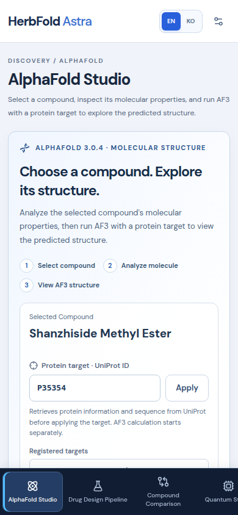 | 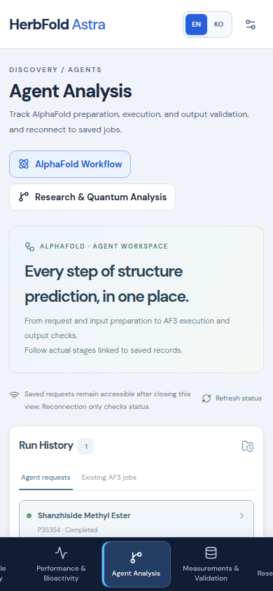 | 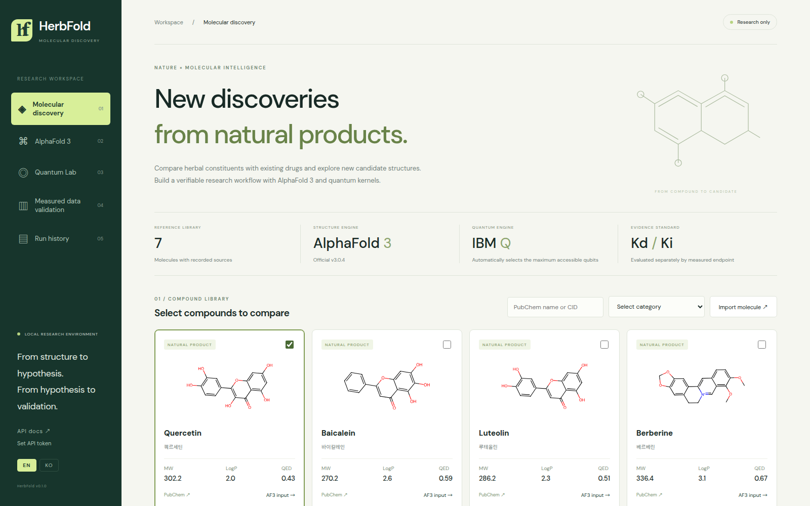 |

**[Drug Design Pipeline / 신약 설계 파이프라인](http://127.0.0.1:9018/#design-pipeline)** provides separate-constituent combination review, BRICS hybrid generation, and single-step natural-product structure transformations. Five deterministic specialist agents validate identities, generate candidates, calculate properties, link exact cached assay observations, and review results; properties and evidence run in parallel. Runs, events and cancellation are saved locally. Inspect actual RDKit conformers in the Three.js viewer, compare parent-relative properties, export results, or continue in AlphaFold Studio. A measured-response calculator compares user-supplied combination inhibition with Bliss and HSA references. Computational proposals and reference-model differences do not establish clinical efficacy or synergy. [Workflow, methods and validation](docs/drug-design-pipeline.md).

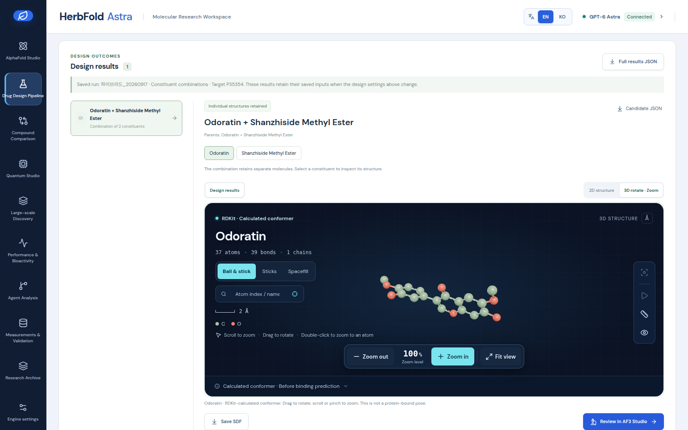

*A saved hybrid design run reopened: generated candidates, retained parent constituents, and an RDKit conformer in the Three.js viewer.*

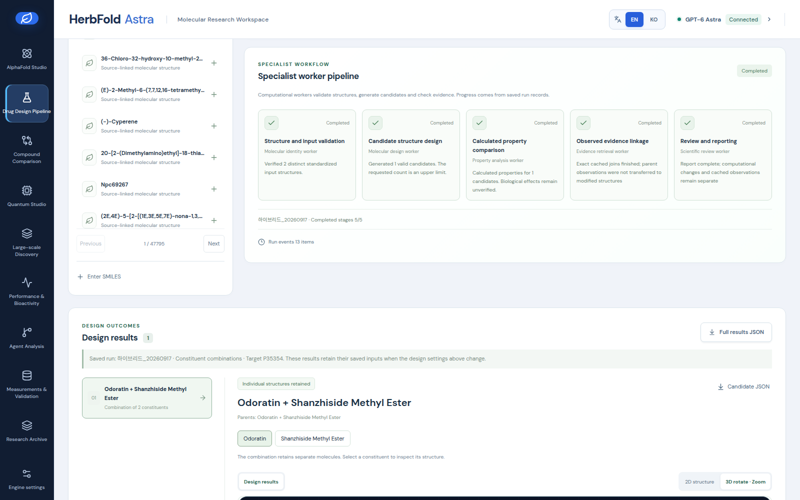

*The five deterministic specialist agents of one saved run, with property calculation and evidence linkage running in parallel.*

**[AlphaFold Studio](http://127.0.0.1:9018/#alphafold)** and **[Quantum Studio](http://127.0.0.1:9018/#quantum)** have separate menus, URLs, and selection states. The structure view shows the selected sample's pTM, ipTM, atomic pLDDT, directional PAE, and MSA evidence. The quantum view shows input features, measured observables, controls, and errors. [Studio separation and validation report](docs/separate-studios-validation.md).

Quantum Studio includes a **five-step visual walkthrough, zoomable actual block circuits, rotation and zoom for XYZ expectation values, a comparison of three kernels, and walkthrough playback**. Visual layouts from the reference paper have been redrawn using the currently stored circuit and measurement data. [User guide and data connections](docs/quantum-studio-visual-guide.md).

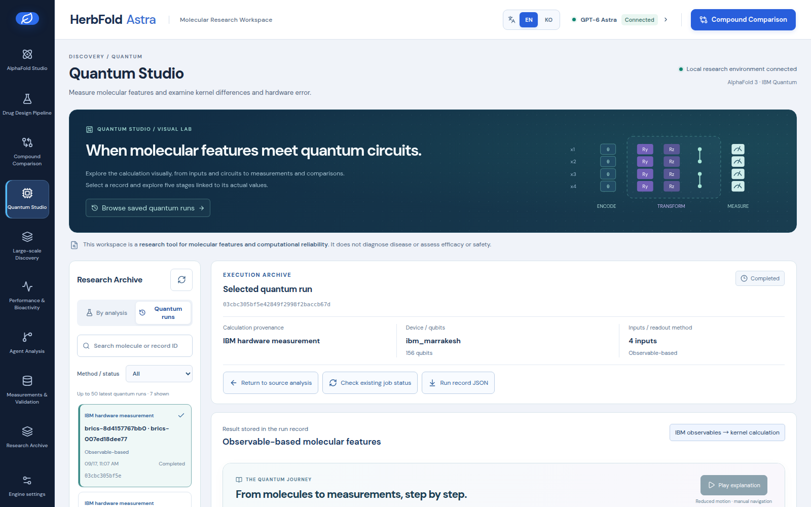

*Quantum Studio: a completed projected-kernel record with its device, qubit count, inputs and readout method.*

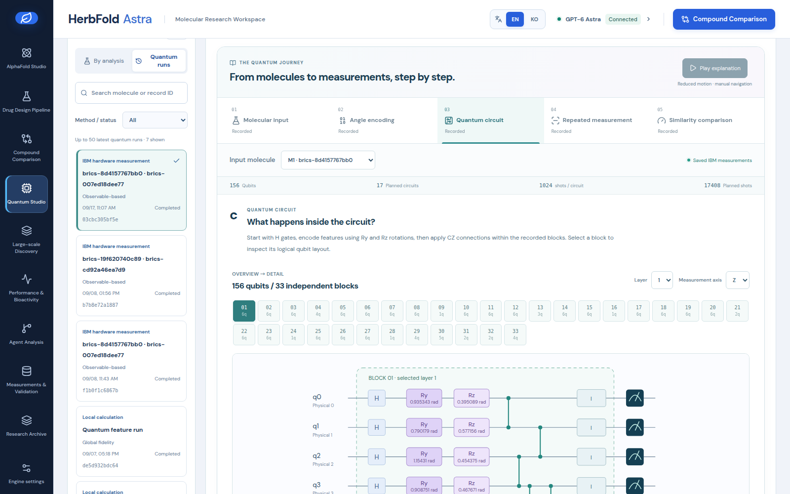

*Step 3 of the walkthrough, drawn from the stored circuit: 156 qubits in 33 independent blocks, with the selected block's rotation angles.*

**The default workflow is compound selection → molecular analysis → AF3 structure inspection.** There is no need to select another drug alongside it. Multiple compounds can be selected in **[Compound Comparison](http://127.0.0.1:9018/#comparison)** or **[Drug Design Pipeline](http://127.0.0.1:9018/#design-pipeline)**. Compound Comparison also supports comparing natural products with one another or existing drugs with one another. [Single-compound and comparison view verification](docs/single-compound-flow-verification.json).

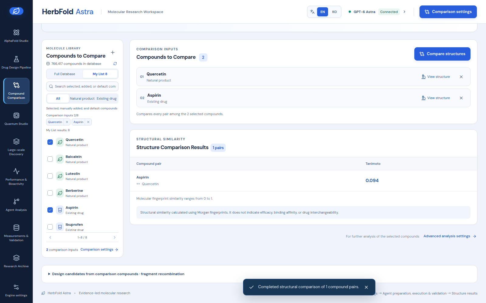

*Compound Comparison: a local Morgan-fingerprint Tanimoto result for quercetin and aspirin. Structural similarity is not efficacy, affinity or interchangeability.*

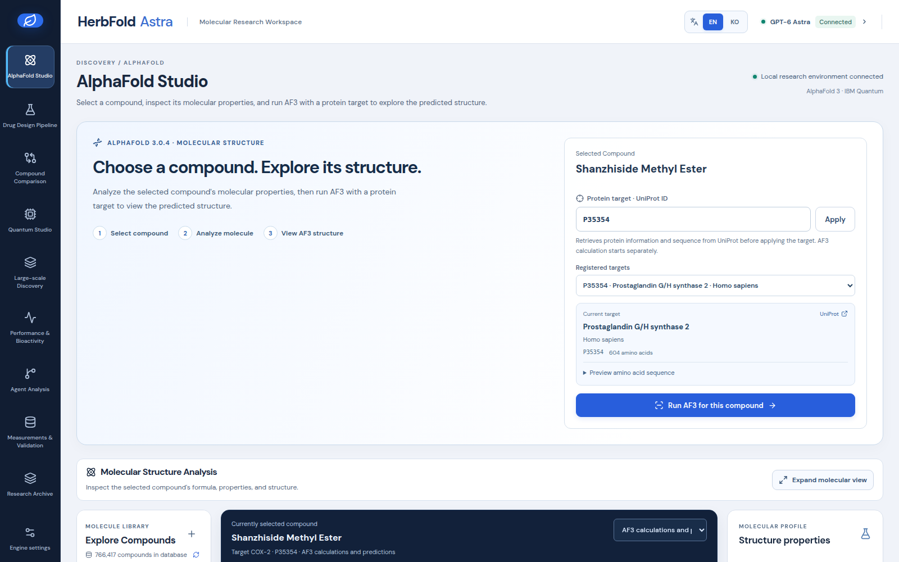

*AlphaFold Studio: the selected compound, the applied protein target, and the predicted structure of a completed job.*

The new React 19 interface uses **Motion 13, GSAP 3, Three.js, React Three Fiber 9, and Drei**. It includes a molecular library, atom and bond exploration, GPT-6 Astra analysis, measured-data validation, and run history. GSAP handles camera zoom and focus movement, while Motion handles UI transitions. The updated high-contrast design supports mouse-wheel, pinch, and keyboard zoom, an actual zoom-level indicator, and an expanded molecular view. [Zoom and design verification](docs/studio-redesign.md).

## Large-Scale Discovery

The **Large-Scale Discovery** menu collects the full public COCONUT and LOTUS datasets and a ChEMBL drug comparison set. Search by 569 Korean medicinal-herb names, species, compound, or source, then open a structure in the studio. Candidate campaigns targeting **up to 100 million candidates** use disk-based deduplication, batches, cursors, and budgets for attempts, time, and storage. Target counts and actual retained counts are reported separately; generated structures are unvalidated research candidates.

This workstation currently stores **766,417 structures and 1,436,510 source records**. The ChEMBL drug comparison set contains 3,417 entries with available structures. These counts reflect downloads and deduplication, not the number of new drugs.

You can also query this database directly from **AlphaFold Studio → Compounds to Explore**. Search by compound name, source identifier, species, or Korean medicinal-herb name, narrow the results with natural-product/existing-drug and source filters, and browse 30 entries per page. Click a compound name to inspect its molecular formula, properties, and structure. The selection persists within the current session when you change the search, page, or view. **My List** also lets you reopen the default examples and compounds you added yourself. **AF3 Calculation for This Compound** opens calculations and records for the selected compound and applied protein target. Select compounds for comparison separately in **Compound Comparison**. Browsing or selecting a list entry does not submit an AF3 calculation.

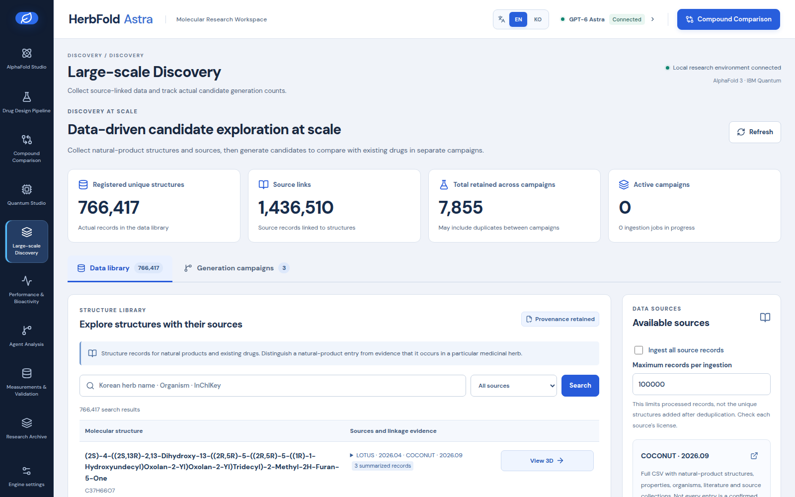

*Large-scale Discovery: registered structures, source links, retained candidates and the searchable structure library with its source evidence.*

[Collection and bulk generation guide and sources](docs/large-scale-discovery.md) · [Measured verification results](docs/discovery-verification.json) · [Storage scale and limitations](docs/discovery-storage.md)

## Performance and Efficacy Validation — 2026-09-08

The **Performance and Efficacy Validation** menu shows actual run results and evidence for each candidate. Using 16 CPU workers, the system processed **5 million distinct fragment combinations** and retained **3,701,740 candidates** after checking molecular properties, duplicates, and contributions from both parents. Preparation took 94.77 seconds, and cumulative active generation and storage time was 304.34 seconds. The current combination limit is 85,150,669, so **generation of 100 million distinct candidates has not been validated and cannot be achieved within the current combination space.** These timings exclude AlphaFold and QPU inference.

Computational efficacy and toxicity evaluations cover all existing candidates and a random sample of 10,000 candidates from the new large-scale set. Measured COX-2/hERG data from ChEMBL and 12 Tox21 assays are used to document independent model evaluation, applicability, and prediction abstention. Candidates outside the sample are not labeled as having confirmed efficacy or safety, and no candidate is classified as a new drug with demonstrated clinical efficacy or human safety.

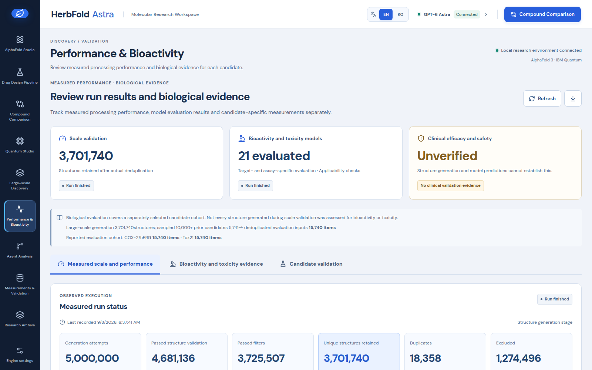

*Performance and Bioactivity: attempts, structures passing validation and filters, retained structures, duplicates and exclusions, each counted separately. Clinical efficacy and safety remain unverified.*

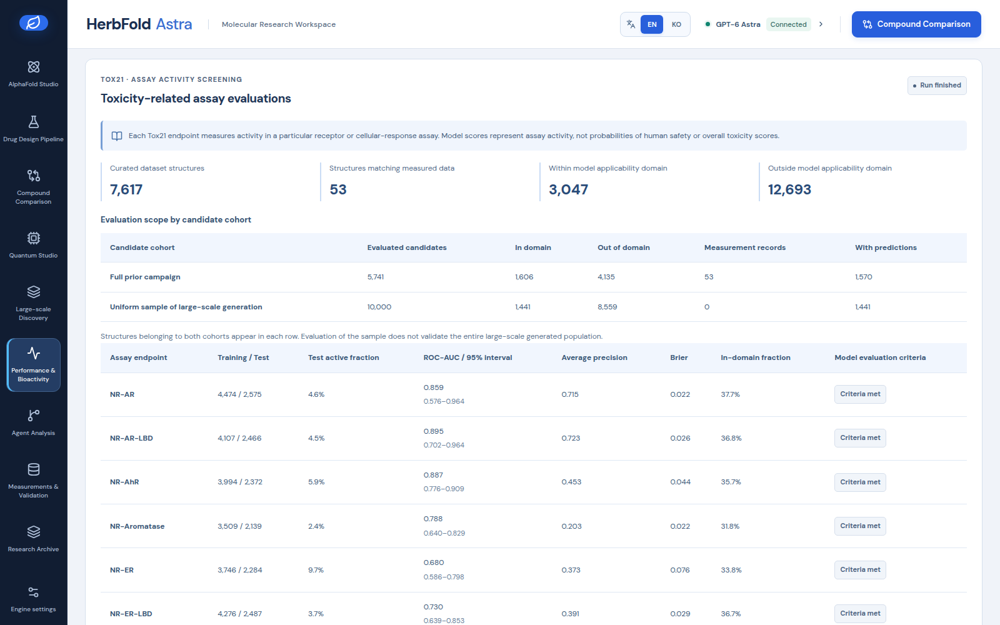

*Tox21 assay evaluations with applicability-domain counts. Assay activity scores are not human-safety probabilities.*

[Final validation report](docs/validation-report.md) · [Machine-readable results](docs/validation-results.json) · [Raw generation performance data](docs/scale-validation-results.json)

## Running the Application

```bash
uv sync --locked --extra dev
# The built UI is included. Rebuild after frontend changes with the following command:
./scripts/build_frontend.sh
./scripts/run.sh
```

This workstation runs with `HERBFOLD_HOST=0.0.0.0`, `HERBFOLD_PORT=9018`, and `HERBFOLD_ALLOWED_HOSTS=*` in `.env`, accepting connections on all IPv4 interfaces and allowing all request hostnames. Forward TCP port 9018 on the router to this computer at `172.30.1.97:9018` to access it over the public internet at `http://PUBLIC_IP:9018` or `http://DOMAIN:9018`. If the router uses a different external port, use that port in the access URL as well. On the same network, use `http://172.30.1.97:9018`. `0.0.0.0` is the server's listening configuration, not an address for clients to connect to. Enter the value from `runtime/access-token.txt` under **Engine Settings → Local API Authentication Token**, then click **Refresh Connection Status**. The token is stored only in page memory and must be entered again after a refresh.

Router port forwarding uses the configuration prepared by the user. To restrict access to specific domains or IP addresses, replace `*` in `HERBFOLD_ALLOWED_HOSTS` with a comma-separated list of allowed hosts. The command-line options `./scripts/run.sh --host ... --port ...` take precedence over `.env`.

The workstation's `.env` already specifies the installed AF3 source, its separate Python environment, the existing model parameter directory, and the selected GPU. IBM authentication uses an existing saved Qiskit account. Secrets are not copied into source or result files.

**2026-09-14 AF3 readiness restored:** Fixed an issue that treated a device-number change as a database file change. After fully verifying the hashes of approximately 911 GB of existing files, validation records were switched to use filesystem UUIDs. GPU preflight checks and input preparation for the selected compound passed. [Cause, recovery, and verification results](docs/af3-readiness-repair.md).

**AF3 execution and result refresh fixes:** Status and logs are fetched independently, with elapsed time, connection status, and GPU memory warnings displayed. If GPU allocation failures persist without other progress, the inference run is stopped while inputs and completed search results are preserved. [Previous GPU allocation failure and fix record](docs/af3-spinner-fix.md).

**Authentication reconnection and structure loading recovery:** Calculation results are fetched again when connection status is refreshed or the browser tab regains focus. If a structure response is delayed, a retry prompt appears after 30 seconds. Actual computation stages are distinguished from waiting for a UI response, and measured duration is displayed on completion. Successful completion of an EGFR job and recovery on desktop and mobile were verified. [Cause, fix, and verification](docs/af3-loading-reconnect.md).

In a new environment, copy `.env.example` to `.env` and configure the paths. Astra analysis requires a server-side `OPENAI_API_KEY` and access to the exact `gpt-6-astra` model. If the key is missing or the model is inaccessible, analysis is blocked; the system does not substitute another model or claim that an LLM was used. The optional Local mode provides a computational workflow without an LLM. Run a status check and a molecular/local quantum demo that requires no network access:

```bash
uv run herbfold doctor
uv run herbfold demo --output runtime/demo.json
uv run pytest -q
uv run ruff check src tests scripts
```

`doctor` performs read-only queries of IBM hardware. `demo` actually computes structural comparisons, BRICS candidates, and a 4-qubit statevector. Neither command automatically submits GPU inference or QPU jobs.

## Implementation Scope

| Stage | Functionality | Outputs |
|---|---|---|
| Compounds | 7 default examples, full COCONUT/LOTUS collection, ChEMBL comparison set, and PubChem additions | Structures, species, synonyms, literature, sources, licenses, and properties |
| Bulk candidates | Target of up to 100 million candidates, disk-based deduplication, batching, resumption, and budget management | Actual generated/retained/rejected counts, parent lineage, and candidate JSON |
| Comparison | Compound Comparison menu, RDKit Morgan fingerprints and stereochemistry-aware Tanimoto similarity for 2–8 compounds | Structural similarity for every selected compound pair, regardless of category |
| Candidates | BRICS fragment recombination, verification of fragment contributions from each parent, and property/QED constraints | Candidate SMILES with lineage from two parents |
| Structures | Official AF3 **3.0.4**, schema 4, native/Docker execution plans, and actual GPU execution | mmCIF, confidence, seeds, versions, and hashes |
| Visualization | Three.js/R3F atom and bond instancing, GSAP camera, and actual Cα backbone | Atomic neighbors, bond orders, distances in Å, SDF, and provenance |
| Orchestration | GPT-6 Astra planning/research/chemistry/design/review/reporting plus AF3/quantum workers | 8-stage DAG, response IDs, usage, checkpoints, and stop/resume support |
| Measured data | ChEMBL Kd/Ki import, CSV, and duplicate/assay checks that preserve the original data | Reviewable data and reasons for exclusion |
| Affinity | Ridge baseline models using measured pKd/pKi, with optional protein and AF3 structure features | JSON models, predictions, and applicability-domain warnings |
| Quantum | Blockwise XYZ projected kernel with legacy fidelity compatibility | Measured features, controls, classical and exact-simulation baselines, actual jobs, shots, and errors |
| Benchmarking | Quantum KRR, classical RBF, and mean baselines using the same data split | Held-out metrics and leakage checks |
| Tracking | SQLite state, per-job inputs/outputs/hashes, and external AF3 output import | Reproducible local run records |

Candidate novelty means that a structure differs from the input molecules. It does not establish novelty across all external compound databases, patent novelty, or synthetic feasibility. PAINS/Brenk alerts and QED are structural alerts and computational metrics; they do not replace toxicity, ADMET, or efficacy validation.

## Recommended Workflow

**Additional targets via UniProt:** Look up and register UniProt IDs in the molecular studio to select proteins beyond COX-2. Review the protein name, species, and sequence length, then apply the target to prepare AF3 inputs using the selected compound and that sequence. Registered targets and per-job sequences and provenance are stored persistently. [Target lookup and registration guide](docs/uniprot-targets.md).

1. Click a compound in **AlphaFold Studio → Compounds to Explore** and inspect its molecular formula, molecular weight, LogP, hydrogen-bond properties, and other characteristics. The default view shows an AF3 prediction; **Free Molecule** mode shows an actual RDKit ETKDGv3 conformer. Add custom molecules through PubChem or SMILES.
2. Apply a protein target in **AlphaFold Studio** and choose the calculation mode, seed, and preparation-only or automatic execution scope. **Prepare/Run in Agents** opens **Agent Analysis → AlphaFold Workflow**, which tracks durable input preparation, queue execution, logs, and output identity validation. Reopening a saved request only reads its status; existing Studio jobs can be attached without rerunning them. Once the exact ligand/target output is verified, **View This Job in Studio** returns that job to the molecular viewer. [Agent workflow and reconnection guide](docs/af3-agent-workflow.md). Job IDs, queues, logs, retries, and result selection are supported, and saved AF3 results can be opened directly. Official Google weights and all 9 MSA/template databases are installed, with readiness checks before execution. The default standard search prepares MSA and templates on the CPU, then runs inference for each selected ligand, reusing validated search results for the same protein. Structural confidence and accuracy limitations are displayed together. `No MSA` is an explicitly selected exploratory mode. [Calculation guide](docs/af3-calculation-workflow.md), [Full database installation evidence](docs/af3-full-msa-setup.md).

   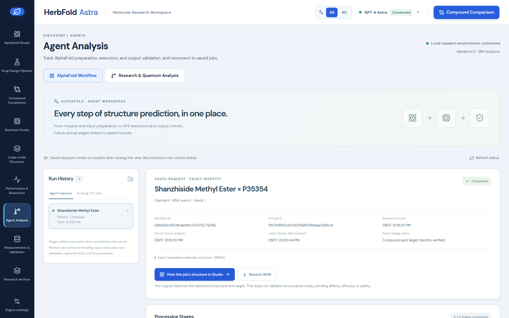

   *Agent Analysis → AlphaFold Workflow: a saved request with its workflow ID, AF3 job ID and verified compound/target identity. A completed run is not a validation of accuracy, affinity, efficacy or safety.*

   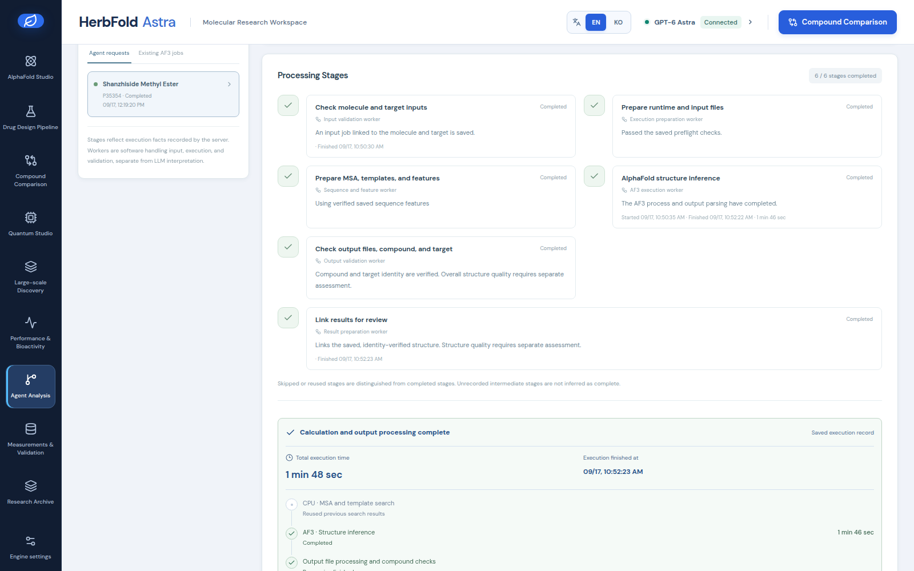

   *Per-stage progress recorded by the server for that job, from input preparation through MSA and template search to inference and output identity checks.*

3. To compare compounds, select 2–8 entries in **Compound Comparison** and click **Compare Structures**. Compounds in the same category can also be compared; the results represent structural similarity. Expand **Design Candidates from Compared Compounds · Fragment Recombination**, or configure Astra analysis in **Advanced Analysis Settings**. This candidate-design extension requires one natural-product parent and one existing-drug parent.
4. In **Quantum Studio**, compare the inputs and linked results of each analysis or inspect individual run records. When rerunning only the quantum stage, review the execution plan that preserves the stored compound order and features. To use IBM hardware for a new agent analysis, select **IBM Maximum Available Qubits** in the quantum settings. The default is a local 4-qubit kernel. Default limits per analysis are 8 LLM calls with 1,800 tokens per response, 1 AF3 candidate, and 1 IBM job with 4,096 shots and 30 QPU seconds.
5. In **Agent Analysis**, inspect per-stage results, response IDs, and actual usage. Stopping and resuming preserves checkpoints for completed stages. Research questions, selected structures, and tool results are sent to the LLM for orchestration.
6. Open a candidate or the **COX-2 Experimental Complex**, drag to rotate, and zoom using the **mouse wheel, two-finger pinch, or zoom buttons**. With the canvas selected, use **+ / −** to zoom and **0** to fit the entire structure. The zoom level reflects the actual camera distance. Click or search for an atom to inspect bond orders, coordinates, and neighbors; use the ruler tool to measure the actual distance between two atoms. Double-click an atom to move the camera to its position.
7. In **Measurements · Validation**, load ChEMBL data, a CSV, or the 21 PTGS2 examples, check duplicates and assays, then evaluate and train. Predictions are distinguished from measurements; AF3 confidence and conformer internal energy are not converted into binding affinity.
8. In **Research History**, reopen structures and models or import AF3 results. Imported AF3-format files are not labeled as verified actual inference runs.

[Orchestrator and API](docs/orchestration.md) · [Molecular graph and coordinate provenance](docs/molecular-viewer.md) · [Library selection and official documentation](docs/viewer-libraries.md)

Use `cd frontend && npm run dev` for frontend development and `npm run build` for a static deployment build. Node 20.19+ or 22.12+ is required. `/` serves the new UI, `/legacy` the legacy compatibility view, and `/docs` the OpenAPI documentation. Do not put API keys in the frontend.

Required columns for measured-data CSV files are listed in [data/affinity_template.csv](data/affinity_template.csv). `relation` must be `=`, `is_measured` must be `true`, and `source` must identify traceable original data. IC50 values are neither converted to nor mixed with Kd/Ki. Unit conversions use exact molar concentrations.

## Interface Language Verification — 2026-09-17

Twenty views were inspected in English mode: nine workspaces on the desktop, the same nine at 390 px, the application shell and the legacy view. **No untranslated interface text remained, no view scrolled horizontally, no page error occurred, and switching the language issued no request.** Twenty Korean research values were deliberately kept unchanged, including saved design-run and campaign names and text typed into fields. Calculation mode, exploratory acknowledgement, seed `0`, the WebGL canvas node, the selected agent workflow with its AF3 job, the selected quantum record and the design candidate list all survived an EN → KO → EN round trip.

```bash
uv run --extra dev python scripts/verify_interface_language.py
```

[Implementation, research-value policy and full results](docs/interface-language.md) · [Machine-readable verification](docs/interface-language-verification.json) · [Screenshot capture record](docs/readme-capture-report.json)

## Actual Verification Results — 2026-09-07

The large-scale discovery extension passed **247 automated tests, Ruff checks, the frontend build, and desktop/mobile browser verification**. Two actual campaigns retained 937 and 4,895 candidates, respectively, yielding **5,741 unique candidates** after combining and deduplicating them again. These counts do not establish new drugs or externally verified novelty. [Actual collection and generation verification](docs/discovery-verification.json) · [UI verification](docs/discovery-ui-verification.json).


The previous version passed **132 automated tests** and completed Python linting, browser functionality/mobile checks, and wheel/sdist builds. Separate verification records for the Astra version are available in [v2 verification](docs/astra-verification.md). The [verification summary](docs/verification_summary.json) and [integration verification with real data APIs](docs/integration_verification.json) have been preserved.

### AlphaFold 3

**2026-09-08 correction:** The earlier **PTGS2 604 aa + ibuprofen** test using the official v3.0.4 program finished in 166.16 seconds, but the local parameters used had zero-valued identifiers and uniform-distribution statistics matching the official randomized benchmark example. This cannot be treated as a prediction from trained AF3. The original files were preserved, and the job was marked `quarantined` and excluded from the selected-compound prediction list.

All 604 N–CA bonds in the previous output fall outside the 0.9–2.1 Å range, with a median of 31.69 Å. Reuse of those earlier test files is blocked. A separately reproduced GPU numerical error passed small-scale diagnostics after setting `AF3_XLA_FLAGS=--xla_gpu_autotune_level=3` in the AF3 child process, but this does not replace trained weights or structure validation. [Parameter and runtime environment audit](docs/af3-runtime-readiness.md).

**Full MSA installation and actual comparison completed:** Validated 672.44 GB of installed data across the 9 official databases and 195,858 PDB mmCIF files, then configured `AF3_DB_DIR`. An actual search for all 604 residues of human COX-2 produced 11,229 unpaired rows, 17,801 paired rows, and 4 templates. Aspirin and quercetin each produced 5 samples through separate GPU inference runs; quercetin reused only the validated protein features. Compared with runs under the same conditions without MSA or templates, the top-ranked pTM/ipTM scores changed from **0.20/0.37 → 0.90/0.88** for aspirin and **0.21/0.32 → 0.89/0.85** for quercetin. RMSD after alignment to the same 551 Cα atoms in the experimental protein structure 5IKR also decreased from 28.720→0.355 Å and 30.306→0.339 Å, respectively. These observations reflect adding both MSA and templates; they do not validate accuracy on independent structures unseen during training, ligand binding poses, efficacy, or safety. `quality_pass=null` is retained. [Actual MSA validation report](docs/af3-msa-validation.md), [Installation evidence](docs/af3-full-msa-setup.md), [Original structures and condition comparison](docs/af3-msa-structure-comparison.json).

**Preserved baseline calculations without MSA:** Verified the CRC32C, full SHA-256, and 405 parameter records of the 1,020,545,840-byte file distributed directly by Google, then set `AF3_MODEL_DIR=/home/jerisuh/models/af3-google-20260604`. The earlier aspirin and quercetin calculations without MSA completed in 164.59 and 162.59 seconds, respectively. With seed 1, 5 samples, and 10 recycles, there are 10 actual samples in total; copies of top-ranked outputs are not counted as additional samples. Compound and target matches were confirmed. After fixing an ILE bond-name template error, both selected outputs had 0 short/long bond warnings. The original coordinates and records of these baseline calculations have been preserved unchanged. [Official acquisition and configuration evidence](docs/af3-google-weights-acquisition.json), [Full parameter inspection](docs/af3-google-weights-validation.json), [Baseline calculation and output validation](docs/af3-trained-selected-predictions.json).

[AF3 execution verification report](docs/af3_verification.json) · [Installation, models, and outputs](docs/alphafold.md)

### IBM Quantum

**Zero-matrix issue fixed and actual remeasurement completed:** The new analysis divides the maximum available qubits into small connected blocks and measures per-qubit X, Y, and Z features. Using the same four inputs as the original results in the current UI, it ran **17 circuits × 1,024 shots** across **all 156 qubits of ibm_fez**, in blocks of up to 4 qubits. Actual off-diagonal kernel values were **0.947082–0.993291**, and a separate repeated identical-input measurement was **0.997848**. IBM job `dafncudnj4cs73agjjsg` used **7.0 QPU seconds** and was pinned to a verified free Open instance. The mean state-preparation/readout error of 1.92% and a maximum of 38.57% for an individual qubit were both recorded. A diagonal of 1 in the new kernel follows from the RBF definition; it does not validate efficacy or quantum advantage. The UI displays original results alongside related reanalyses, observables, errors, and baselines. [New quantum analysis validation](docs/quantum-projected-validation.md), [Actual measurements](docs/quantum-projected-verification.json).

**Preserved earlier global fidelity check:** After confirming the free Open plan and remaining quota, a single run of 3 circuits × 1,024 shots was executed across **all 156 qubits of ibm_fez**. IBM job `daf6tvm42tqs73avi9u0` used **3.0 QPU seconds**.

No all-zero outcome was observed in any circuit, so the original kernel is `[[0,0],[0,0]]`. Actual 156-bit measurement results were checked, and the diagonal entries were not arbitrarily changed to 1. **Successful execution at the maximum qubit count does not imply useful binding information or a quantum performance advantage.** Noise and information loss at large circuit widths must be evaluated and compared with smaller-width baseline experiments.

[Actual IBM execution report](docs/quantum_verification.json) · [Quantum execution and budgets](docs/quantum.md) · [Quantum regression using measured data](docs/kernel_model.md)

### Real ChEMBL Data

The evaluation used **21** real human PTGS2 Ki records that met the original-data and assay-metadata criteria. With a fixed scaffold split of 17 training and 4 test records, RMSE(pKi) was **1.9743** for descriptor Ridge, **1.9268** for the local 4-qubit model, **1.8847** for classical RBF, and **1.9346** for the training-mean baseline. All R² values were negative, so neither generalization performance nor quantum advantage was demonstrated. These results should be interpreted as a technical validation using a small sample with mixed assays.

[Data, exclusion criteria, and evaluation report](docs/data_verification.json) · [Data with provenance](data/benchmarks/ptgs2_ki.json)

The results are not labeled as a reproduction of the supplied paper's performance because of its `[DATA-URL]`, `[CODE-URL]`, and `[N-TOTAL]` placeholders and inconsistencies in data and performance figures. See [Scientific design and paper review](docs/science.md) for the detailed assessment.

## AF3 Environment

The official source is in `external/alphafold3`, with a separate virtual environment in its `.venv` subdirectory. Reinstallation script:

```bash
bash scripts/setup_af3.sh
```

Model parameters are obtained from the [official Google distribution location](https://storage.googleapis.com/alphafold3/af3.bin.zst) and are not included in the platform package. The [parameter terms](https://github.com/google-deepmind/alphafold3/blob/v3.0.4/WEIGHTS_TERMS_OF_USE.md) and [output terms](https://github.com/google-deepmind/alphafold3/blob/v3.0.4/OUTPUT_TERMS_OF_USE.md) apply separately from the code license. Review those terms to determine whether commercial use for drug development is permitted.

The full MSA/template database setup retains approximately 239 GB of official compressed files and 672 GB of installed data, so allow roughly 1 TB or more, including spare space. The validating installer below resumes downloads of the 9 pinned official sources and checks CRC32C, MD5, SHA-256, compression boundaries, and all records. Standard search requires a completed `official_databases_manifest.json`.

```bash
uv run --locked --extra databases python scripts/install_af3_databases.py --directory /absolute/path/to/af3_databases
bash scripts/setup_hmmer.sh
```

After completion, set `AF3_DB_DIR` in `.env` to the installation path and restart the server. HMMER 3.4 is used with the official AF3 sequence-limit patch. Detailed configuration is available in `.env.example` and the [MSA search and cache operations guide](docs/af3-calculation-workflow.md). In the current GPU environment, global CUDA library paths conflicted with the official JAX CUDA libraries, so those paths are isolated only in the AF3 child process. Other workloads and system CUDA settings are unchanged. GPU memory preallocation is disabled by default.

## Data and Operations

- API access defaults to loopback. To serve external hosts, configure `HERBFOLD_API_TOKEN`, `HERBFOLD_ALLOWED_HOSTS`, and an HTTPS proxy separately. The default deployment is a single process for a personal research workstation.
- Job records and actual structures are stored in `runtime/`. Local AF3 jobs still running when the server restarts are marked `interrupted` and are not automatically resubmitted before their results are checked. IBM jobs are recovered by querying their saved job IDs.
- For N molecules, the IBM circuit count, including diagonal entries, is `N(N+1)/2`. For 24 molecules, this is 300 circuits. Limits for shots, circuits, and jobs are configured separately. `max_execution_time` limits QPU execution per job; it does not guarantee a maximum cost or waiting time.
- Original structures, computed kernels, trained-model predictions, and experimental measurements occupy separate fields. Synthesis, cell/animal experiments, toxicity, pharmacokinetics, and clinical validation require separate research.
- 3Dmol.js is bundled locally, with its original license and SHA256 preserved in the [third-party records](docs/third_party.md).

## Key Official References

- [AlphaFold 3 v3.0.4 release](https://github.com/google-deepmind/alphafold3/releases/tag/v3.0.4), [Inputs](https://github.com/google-deepmind/alphafold3/blob/v3.0.4/docs/input.md), [Outputs](https://github.com/google-deepmind/alphafold3/blob/v3.0.4/docs/output.md)
- [IBM Runtime SamplerV2](https://quantum.cloud.ibm.com/docs/en/api/qiskit-ibm-runtime/sampler-v2), [Plans and instances](https://quantum.cloud.ibm.com/docs/en/guides/instances)
- [PubChem PUG REST](https://pubchem.ncbi.nlm.nih.gov/docs/pug-rest), [ChEMBL REST](https://www.ebi.ac.uk/chembl/api/data/docs), [UniProt REST](https://www.uniprot.org/help/api_queries)
- [RDKit BRICS](https://www.rdkit.org/docs/source/rdkit.Chem.BRICS.html), [3Dmol.js](https://3dmol.org/doc/)
