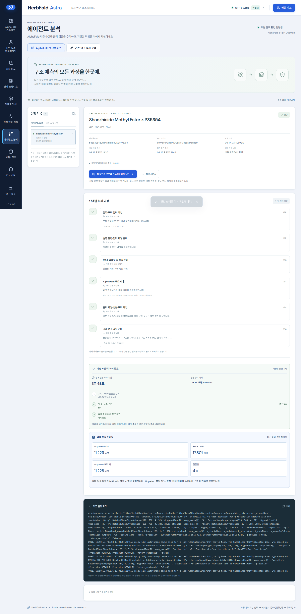
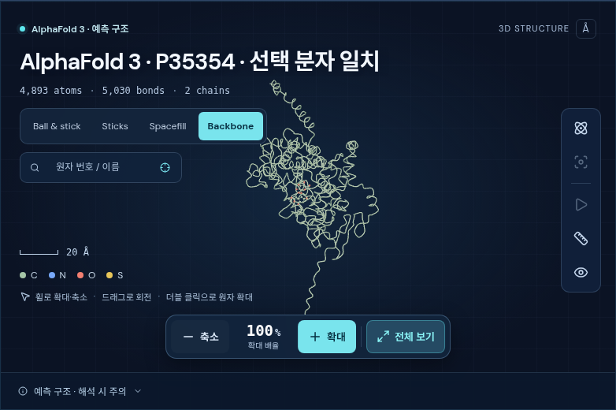

# AlphaFold Studio와 에이전트 실행 연결

AlphaFold Studio는 선택한 분자·표적과 최종 구조를 확인하는 화면이다. 실행 준비, AF3 대기열·추론 상태, 로그와 결과 연결은 에이전트 작업으로 저장한다. 화면 이동이나 브라우저 새로고침이 서버의 AF3 계산을 취소하거나 새 계산을 제출해서는 안 된다.

## 확인된 기존 상태

2026-09-17 읽기 전용 점검에서 가장 최근의 Studio AF3 작업 세 개는 모두 `completed`였다. 각 선택 구조 파일이 존재했고 저장된 SHA-256과 일치했다. 가장 최근 작업 `6f07b8942cb04005afe1388aae7ddbc9`는 01:52:23 UTC에 완료되었다. 이 세 작업 ID는 기존 `analyses` 기록에는 포함되어 있지 않았다.

반면 최근 갱신된 기존 분석 `87c85b9906634e2da23929f5b4976b71`은 전체 상태와 structure 단계가 완료여도, 내부 AF3 항목은 예전에 데이터베이스 지문 검사로 차단된 `dada0d43e251403aaaf5864b84685592`를 가리켰다. 따라서 Studio 계산의 완료와 별도 분석 화면의 중간 처리 상태가 일치하지 않는 연결 공백이 있었다. 이전 분석 결과를 새 작업 결과로 덮어쓰는 대신 새 연결 기록에서 실제 작업 ID를 추적한다.

9월 16일의 별도 실패 기록에는 JAX의 `RESOURCE_EXHAUSTED`와 6.16 GiB 할당 실패가 명시되어 있다. 이후 최근 세 작업은 완료되었으므로 이 과거 메모리 오류를 현재 화면의 끊김 원인으로 단정할 수 없다. 서버 접근 로그의 일부 401 응답도 정확한 시각과 사용자 세션이 연결되지 않아 원인으로 확정하지 않았다. 점검 당시 저장된 queued/running 작업과 분석은 없었다. 이 상태는 점검 시점의 관찰이며 이후 실행까지 보장하지 않는다.

점검 기록은 [읽기 전용 runtime 감사 JSON](af3-agent-workflow-runtime-audit.json)에 있다. 작업용 원본은 `tmp/af3_workflow_20260917/runtime-readonly-audit.json`이다. 점검 중 원본 작업, 분석, 실행 환경을 수정하거나 AF3·LLM·QPU 실행을 제출하지 않았다.

## 재연결과 실행 원칙

- 실행 요청의 고유 `request_id`를 준비 전에 저장한다. 동일 요청을 다시 전송하면 저장된 작업을 찾는다.
- Studio가 만든 AF3 `job_id`를 실제 실행 제출 전에 연결 기록에 저장한다.
- 화면을 다시 열 때는 저장된 에이전트 작업과 연결된 AF3 작업을 조회한다. 재조회 자체는 추론 실행이나 자동 재시도를 뜻하지 않는다.
- 기존 AF3 작업을 연결할 때 분자·표적의 동일성을 검사한다. 다른 표적의 결과를 현재 선택에 연결하지 않는다.
- 연결이 끊겨 준비 여부가 불확실하면 상태를 명시하고 확인된 기존 작업을 복구한다. 서버 재시작만으로 AF3 계산을 새로 제출하지 않는다.
- 준비된 입력을 실제로 실행하거나 실패 후 다시 시작하는 작업은 명시적 실행 동작과 구분한다.

AF3 상태의 `completed`는 프로세스와 출력 읽기가 완료되었다는 뜻이다. 분자 동일성이 확인되어도 구조 품질, 결합친화도, 효능 및 안전성이 검증되었다는 뜻은 아니다. 입체 구조 신뢰도와 assay 관측값은 별도 근거로 표시한다.

기존 실행 큐는 프로세스 완료를 먼저 기록하고 출력 동일성 확인을 뒤이어 저장한다. 이 사이에는 결과 표시를 중단하지 않고 `validating`으로 추적한다. 진행 중이라고 표시하려면 최근의 출력 확인 단계와 살아 있는 실행 소유자의 기록이 필요하다. 검증 기록이 없는 과거 작업은 확인 불가 상태로 남으며 영구적인 실행 중 상태로 바꾸지 않는다. 실행 제출 응답을 기다리는 동안에도 활성 상태를 먼저 저장해, 잠깐의 `prepared` 응답 때문에 화면 추적이 종료되지 않도록 한다.

## 저장 API

| 요청 | 동작 |
| --- | --- |
| `POST /api/af3-workflows` | UUID `request_id`, 성분·표적·MSA 모드·seed·실행 여부를 저장하고 비동기로 입력 준비 |
| `GET /api/af3-workflows/by-request/{request_id}` | POST 응답을 잃었을 때 같은 요청 복구 |
| `GET /api/af3-workflows` | 저장된 연결 작업 목록 |
| `GET /api/af3-workflows/{id}` | 선택 작업과 실제 Studio 상태 재조회 |
| `GET /api/af3-workflows/jobs` | 연결할 기존 Studio 작업 목록 |
| `POST /api/af3-workflows/attach` | 기존 `job_id`를 연결하며 새 추론은 제출하지 않음 |
| `POST /api/af3-workflows/{id}/resume` | `{ "confirm": true }`로 명시적 준비·실행 재개 |

같은 `request_id`로 다른 입력을 보내면 충돌로 거절한다. `execute: false`는 준비만 요청한다. 실행을 요청한 원래 작업의 준비를 재개하면 저장된 실행 설정에 따라 추론까지 이어질 수 있으므로 화면에서 그 범위를 표시한다. MSA·template 생략 모드는 `exploratory_ack: true`를 요구한다. 단순 기록 조회와 기존 작업 연결은 해당 실행 요청을 대신하지 않는다.

한 runtime에는 AF3 workflow 서비스 소유자 하나만 허용한다. 프로세스 수명 동안 유지되는 파일 잠금은 다른 서버가 같은 저장소의 작업을 복구·변경하는 것을 막는다. 실제 AF3 프로세스와 대기열은 기존 실행 큐가 소유하며 연결 기록의 종료가 GPU 작업 취소 명령은 아니다.

## 검증 범위

통합 검증은 임시 저장소와 합성 Studio 응답으로 작업 저장·중복 요청·연결 복구·기존 작업 연결을 검사한다. 합성 결과는 상태 전환을 시험하기 위한 것이며 AF3 계산 결과나 새로운 생물학적 근거가 아니다. 운영 runtime에 합성 작업을 넣거나 실제 GPU·LLM·QPU 실행을 제출하지 않는다.

실제 운영 작업은 읽기 전용으로 완료 상태와 선택 파일의 해시를 확인하고, 새 API의 실행 계약은 격리된 검증으로 확인한다. 전자는 결과 보존의 근거이고 후자는 프로그램 동작의 검사다.

```bash
.venv/bin/python scripts/verify_af3_workflow.py --output tmp/af3_workflow_20260917/isolated-http-verification.json
```

2026-09-17 03:14 UTC의 격리된 HTTP 검사에서 다음을 확인했다.

- 0.7초 지연을 넣은 합성 준비 작업에 대해 요청 접수는 0.0217초에 반환했고, 동일 요청 ID를 다시 보내도 준비·실행이 중복되지 않았다.
- POST 응답을 읽지 않고 연결을 닫아도 요청 ID로 작업을 찾았다. 준비 중 서버를 강제 종료한 뒤에는 저장된 요청을 복구했으며 자동 준비·실행 호출이 없었다.
- 준비만 요청한 작업은 명시적으로 준비를 재개해도 추론을 제출하지 않았다. 별도의 실제 실행 동작은 큐 응답을 0.35초 지연시켜도 202 응답과 즉시 재조회부터 활성 상태였다.
- AF3 프로세스 완료와 출력 동일성 확인 사이를 `validating`으로 유지했다. 합성 미검증 완료 기록을 사용 가능한 구조로 표시하지 않았다.
- 기존 작업 연결은 중복되지 않았고 다른 분자·표적은 거절했다. Studio 준비 응답을 잃었어도 이미 저장된 정확한 작업을 찾아 연결했으며 자동 실행하지 않았다.
- 모든 합성 실행 제출 전에 작업 ID 연결이 SQLite에 저장되어 있었다. 완료 기록을 반복 조회해도 상태·이벤트·갱신 시각이 임의로 바뀌지 않았다.

실행 결과와 소스 SHA-256은 [API 검증 JSON](af3-agent-workflow-api-verification.json)에 있다. 영수증의 합성 어댑터 호출 횟수는 준비 8회·실행 3회이며, 실제 AF3·LLM·QPU 실행 횟수는 0회다. 이 검사는 제어 흐름 검증이며 새로운 AF3 예측, 구조 정확도 또는 약효 검증은 아니다.


## 운영 적용 및 화면 사용

2026-09-17 운영 서버 `http://127.0.0.1:9018`에 적용했다. 새 계산을 제출하지 않고 최근 완료 작업 `6f07b8942cb04005afe1388aae7ddbc9`를 워크플로 `b86a39c482db4ad1b1c1c0172c77a76e`에 연결했다. 정확한 구조가 대규모 목록의 `discovery_5868`, **Shanzhiside Methyl Ester**와 일치한다. 표적은 P35354이며 LOTUS·COCONUT에 기록된 천연물 분류를 유지했다. 특정 한약재 함유나 약효를 추가로 추론하지 않았다. 기존 작업의 상태·갱신 시각과 선택 구조 파일 해시는 보존되었다. [운영 적용 확인](af3-agent-workflow-production-verification.json).

1. **AlphaFold 스튜디오**에서 성분·표적·계산 모드·시드·실행 범위를 선택하고 **에이전트에서 준비·실행** 또는 **에이전트에서 입력 준비**를 누른다.
2. **에이전트 분석 → AlphaFold 워크플로우**에서 입력 확인 → 실행 환경 확인 → MSA·특징 준비 → 구조 추론 → 출력 동일성 확인 → 결과 연결을 확인한다. 요청·작업 ID, 실제 실행 로그, 중단 사유, 재개 동작이 함께 표시된다.
3. 확인된 완료 작업의 **이 작업의 구조를 스튜디오에서 보기**를 누르면 정확한 성분·표적·작업 ID를 선택해 3D 구조를 연다.

기존 계산은 스튜디오의 **에이전트에서 이어 보기** 또는 에이전트 화면의 **기존 AF3 작업**에서 연결한다. 첫 방문은 가장 최근 저장 요청을 선택하며 이후에는 선택한 워크플로를 기억한다. 기존 연구와 양자 분석은 같은 메뉴의 **기존 연구·양자 분석**에서 유지한다. 접수 응답이 끊긴 경우 브라우저에 남은 요청 ID로 **접수된 작업 찾기**를 수행한다. 서버가 API 인증을 요구하는 환경에서 새로고침 후 인증이 사라지면 **엔진 설정 → 로컬 API 인증 토큰 → 연결 상태 새로 고침**으로 다시 연결한다. 인증 토큰은 브라우저의 영구 저장소에 기록하지 않는다.

최종 검증은 Python 테스트 **839개**, 화면 로직 테스트 **64개**, TypeScript·배포 빌드와 Ruff를 통과했다. 합성 CPU 브라우저 시험은 실행 제출을 1초, 출력 검증을 8초 지연시켜도 진행 추적이 유지되는지 확인했다. 새로고침·오프라인 재연결에 추가 제출이 없고, 검증 중에는 결과 버튼이 표시되지 않으며 완료 뒤 정확한 작업으로 돌아가는 것을 확인했다. 운영 브라우저에서는 초기 401 이후 인증 회복, 가장 최근 저장 작업 선택, 실제 구조 표시, 기존 메뉴, 390 px 화면의 가로 넘침 여부를 검사했다. JavaScript 오류와 예상 밖 실행 요청은 없었다. [화면 검증 기록](af3-agent-workflow-ui-verification.json).





브라우저 제어 흐름 시험을 재현하려면 연결된 내장 브라우저를 우선 사용한다. 사용할 수 없는 경우 아래 격리된 시험 서버와 로컬 Chrome 검증 스크립트를 사용할 수 있다. fixture 데이터 경로는 존재하지 않는 새 경로여야 한다.

```bash
PYTHON_DOTENV_DISABLED=1 HERBFOLD_API_TOKEN= .venv/bin/python tests/helpers/af3_studio_fixture_server.py --data-dir tmp/af3-workflow-browser-new --port 9022 --workflow-delay-controls
# 별도 터미널: Playwright와 로컬 Chrome이 설치된 Python 사용
python scripts/verify_af3_workflow_ui.py --url http://127.0.0.1:9022 --output tmp/af3-workflow-browser-check
```
