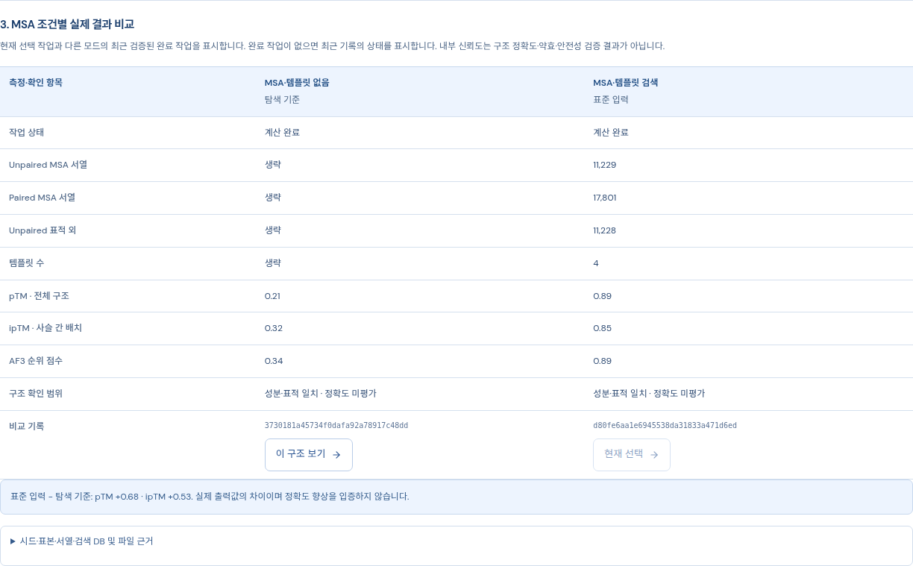
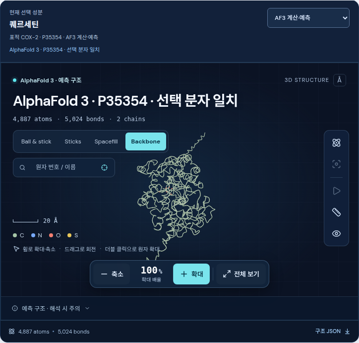

# 전체 MSA 구성과 실제 COX-2 복합체 비교

2026-09-08 KST. **공식 AF3 전체 9종 데이터베이스를 설치·검증하고, 실제 MSA·템플릿 검색과 아스피린·퀘르세틴의 별도 GPU 추론을 완료했습니다.** 같은 조건의 이전 MSA 미사용 계산보다 두 복합체의 구조 신뢰도와 실험 단백질 구조에 대한 좌표 일치도가 높아졌습니다. 이번 비교는 MSA와 구조 템플릿을 함께 추가한 결과이며, 두 요소의 효과를 분리한 실험은 아닙니다.

## 설치와 적용

`AF3_DB_DIR`은 다음 경로로 설정했고, 운영 API를 재시작하여 표준 검색의 준비 검사에 차단 사유가 없음을 확인했습니다.

```text
/media/jerisuh/8ddd80eb-6ff2-439e-bc5f-fa97b55fa26c/alphafold3_databases/v3.0
```

BFD, MGnify, UniRef90, UniProt, PDB seqres, RNAcentral, NT-RNA, Rfam과 PDB mmCIF 전체를 갖췄습니다. 설치 데이터는 **672,435,030,468바이트**, 보존한 공식 압축 원본은 **238,784,443,666바이트**, mmCIF는 **195,858개**입니다. 여기서 전체는 고정된 공식 AF3 v3.0 데이터 배포본의 전체 구성이라는 뜻입니다. 향후 추가되는 모든 생물학 자료를 자동 포함한다는 뜻은 아닙니다.

설치기는 원본 Google CRC32C·MD5, 전체 SHA-256, zstd 프레임 끝과 체크섬, 전체 FASTA 형식·레코드 및 CIF별 해시를 검사했습니다. 독립 사후 감사는 설치 기록, 원본·설치 파일 상태, 전체 CIF 목록과 195,858개 파일의 크기·상태를 다시 대조했습니다. 사후 감사가 672 GB 전체를 다시 해시했다고 주장하지 않습니다. 요청 시에는 완료 기록과 파일 상태를 검사하므로 DB는 변경하지 않고 보존해야 합니다. [설치 방법·검증 범위](af3-full-msa-setup.md), [실제 설치 감사](af3-full-database-installation.json)

공식 AF3 **v3.0.4**, commit `85c4d20505fd5cef05eac22b534d4e793971ae69`와 Google 배포 가중치를 사용했습니다. 가중치의 전체 SHA-256은 `74d0258616917cd122f5eab6d076afe4a8930e96823851e65e4f777dfb1f33ff`입니다. 기존 무작위 성능 시험 파라미터와 격리한 이부프로펜 출력은 사용하지 않았습니다. [가중치 취득](af3-google-weights-acquisition.json), [전체 가중치 검사](af3-google-weights-validation.json)

## 실제 MSA 검색 결과

사람 COX-2/PTGS2 **P35354 전체 604개 잔기**를 공식 HMMER 데이터 파이프라인으로 검색했습니다. CPU 검색 단계는 **452.12초**였으며, query와 각 정렬의 길이·내용, 템플릿 좌표 및 잔기 매핑을 검증한 뒤 추론 입력에 넣었습니다.

| 관측 항목 | Unpaired MSA | Paired MSA |
| --- | ---: | ---: |
| query 포함 정렬 행 | 11,229 | 17,801 |
| query 첫 행을 제외한 행 | 11,228 | 17,800 |
| 중복 제거 후 정렬 서열 수, query 포함 | 11,229 | 11,545 |
| 중복 정렬 행 | 0 | 6,256 |
| query 외 각 행의 표적 피복률 중앙값 | 20.70% | 18.05% |
| query 외 각 행의 표적 피복률 95백분위 | 78.48% | 93.21% |
| query 외 서열이 하나 이상 있는 표적 위치 비율 | 100% | 100% |
| 위치별 query 외 비갭 행 수, 최소 / 중앙값 / 최대 | 41 / 2,979.5 / 7,226 | 146 / 4,950.5 / 9,524 |

이 수는 검색이 저장한 정렬 행에 대한 진단입니다. 표의 query 외 행은 첫 query 행을 제외한 것으로, paired MSA에는 query와 동일한 서열이 1행 더 남아 있습니다. 서로 다른 두 MSA의 수를 합쳐 독립 상동 서열 수로 해석하지 않습니다. 짧은 정렬과 중복이 있으며 유효 서열 수 **Neff**를 계산한 결과가 아닙니다. 단백질 하나와 소분자로 된 이번 입력에서 paired 필드의 존재는 단백질–리간드 공진화 증거를 뜻하지 않습니다. 모델 내부의 MSA 선택·피처 처리를 거치므로 저장된 모든 행이 독립적으로 모델에 사용됐다고 주장하지 않습니다.

| 채택한 템플릿 | 매핑된 query 잔기 수 |
| --- | ---: |
| 1PXX | 604 |
| 3QH0 | 600 |
| 3LN0 | 587 |
| 4RRX | 587 |

템플릿 날짜 상한은 **2021-09-30**입니다. 각 템플릿의 원본 mmCIF와 query/template 인덱스, 해시를 보존했습니다. 캐시의 단백질 피처 SHA-256은 `2a40d3128f4f8aab9a3896fcaa9836cda87135a6a2dd4e706ea4314acd8c0923`, DB 지문은 `1ac78093e381753979c045f98c902dfa22f2a5391a6d3cdeae90bc3c92518ded`입니다. [실제 정렬·템플릿 감사](af3-msa-structure-comparison.json)

## 물질별 실제 계산과 이전 결과 비교

비교 조건은 전체 표적 서열, 각 물질의 정확한 이성질체 SMILES, 가중치 파일 내용, AF3 코드, GPU 1 및 수치 설정, **seed 1 · diffusion sample 5개 · recycle 10회 · 템플릿 날짜 상한**을 동일하게 유지했습니다. 이전 두 작업은 MSA와 템플릿을 모두 명시적으로 생략했고, 새 두 작업은 검증한 검색 피처를 사용했습니다.

아래 수치는 AF3가 ranking score로 선택한 각 작업의 최상위 표본입니다. 단백질 pLDDT는 전체 604개 Cα의 평균이며, 리간드 pLDDT는 중원자 평균입니다.

| 지표 | 아스피린, 미사용 → MSA·템플릿 | 퀘르세틴, 미사용 → MSA·템플릿 |
| --- | ---: | ---: |
| pTM | 0.20 → **0.90** | 0.21 → **0.89** |
| ipTM | 0.37 → **0.88** | 0.32 → **0.85** |
| 평균 단백질 Cα pLDDT | 29.27 → **92.81** | 30.34 → **92.84** |
| 평균 리간드 pLDDT | 15.49 → **72.94** | 13.65 → **65.84** |
| 5IKR와 일치시킨 551개 Cα RMSD | 28.720 → **0.355 Å** | 30.306 → **0.339 Å** |

새 계산의 전체 5개 표본에서도 아스피린 pTM은 0.90, ipTM 범위는 0.85–0.88이었고, 퀘르세틴 pTM은 0.89, ipTM 범위는 0.81–0.85였습니다. 5IKR와의 Cα RMSD 범위는 각각 0.327–0.371 Å와 0.330–0.374 Å였습니다. 같은 seed에서 나온 5개 표본이므로 이를 독립 반복 실험이나 모집단 신뢰구간으로 취급하지 않습니다.

| 새 작업 | 실행 경로 | GPU 추론 단계 시간 | 정확한 리간드 중원자 |
| --- | --- | ---: | ---: |
| 아스피린 `b868a97038e144f8a605a722d911338b` | CPU 검색 → 피처 검증 → GPU 추론 | 167.84초 | 13 |
| 퀘르세틴 `d80fe6aa1e6945538da31833a471d6ed` | 검증된 단백질 캐시 → 별도 GPU 추론 | 165.34초 | 22 |

퀘르세틴의 실제 실행 단계는 `inference` 하나입니다. CPU 검색을 반복하지 않았고, 캐시 키·피처 해시·DB 지문은 아스피린과 같으면서 리간드 입력과 출력 좌표 파일은 별개임을 확인했습니다. 최초 검색 시간과 각 추론 시간을 구분했으며, 시간은 이 워크스테이션의 실제 관측값으로 다른 장비의 성능을 보장하지 않습니다.

새 표본 10개와 이전 표본 10개의 원본 좌표·신뢰도 파일을 검사했습니다. 각 작업의 최상위 복사 파일은 추가 표본으로 세지 않았습니다. 전체 단백질 서열과 정확한 리간드 정체성, 유한 좌표, 실제 추론이 저장한 `*_data.json`과 검증 피처의 일치, ranking 파일과 최상위 선택을 확인했습니다. 새 두 최상위 출력의 짧거나 긴 명명된 공유결합 경고는 0개이고, AF3의 `has_clash`는 false입니다. 간단한 결합 길이 검사나 AF3 clash 플래그를 정밀 입체화학 검증으로 해석하지 않습니다. [실제 작업 기록](af3-msa-selected-predictions.json), [원본 대조 감사](af3-msa-structure-comparison.json), [보존한 미사용 기준 계산](af3-trained-selected-predictions.json)

## 해석과 한계

이번 결과는 **이 두 COX-2 입력에서 구조 신뢰도와 실험 단백질 구조에 대한 관측 일치도가 개선됐다는 근거**입니다. pTM·ipTM·pLDDT는 예측 신뢰도이며 친화도, 결합 확률, 약효 또는 독성의 측정값이 아닙니다. 리간드 신뢰도는 단백질 핵심 구조의 신뢰도보다 낮고, 전체 단백질의 모든 위치가 높은 신뢰도를 갖는 것도 아닙니다. [공식 AF3 출력 해석](https://github.com/google-deepmind/alphafold3/blob/v3.0.4/docs/output.md)

RMSD는 실험 구조 **5IKR chain A**의 관측된 551개 Cα를 서열과 SIFTS 매핑으로 확인하고, 같은 잔기 집합 전체를 Kabsch 정렬한 값입니다. 제외한 이상치나 가중치는 없습니다. 5IKR는 mefenamic acid 복합체이므로 이 계산은 아스피린·퀘르세틴의 **결합 자세 검증이 아닙니다**. 검색에서 채택한 네 템플릿에 5IKR 자체는 없었지만, 다른 관련 템플릿과 AF3 학습 자료의 영향을 배제하지 않았습니다. 따라서 독립된 미학습 구조에 대한 정확도 검증으로 주장하지 않습니다. [실험 구조 5IKR](https://www.rcsb.org/structure/5IKR)

일반화된 정확도나 약효·안전성 인증은 수행하지 않았으므로 `quality_pass=null`, `efficacy=not_assessed`, `safety=not_assessed`를 유지합니다. 수백만 후보 전체의 계산이나 검증을 이번 두 물질의 결과로 대체하지 않습니다.

## 재현과 사용

분자 스튜디오에서 물질을 선택하고 **저장된 AF3 예측**을 열면 해당 물질의 계산 기록을 확인할 수 있습니다. MSA 미사용/표준 검색 결과 비교에서 동일 조건 여부, 실제 정렬·템플릿 수와 캐시 출처를 확인하고 각 결과의 3D 구조로 전환합니다. 새 물질은 기본 표준 검색 모드로 준비·실행하며, 같은 검증된 표적 피처를 재사용하더라도 리간드별 추론은 별도로 수행합니다. [계산 운영 방법](af3-calculation-workflow.md)

원본 자료만 다시 감사하는 명령은 다음과 같습니다. 새 GPU 계산을 제출하지 않습니다.

```bash
.venv/bin/python scripts/verify_af3_msa_comparison.py \
  --baseline-report docs/af3-trained-selected-predictions.json \
  --msa-report docs/af3-msa-selected-predictions.json \
  --output docs/af3-msa-structure-comparison.json
```

Python 테스트 **483개**, Ruff, 프런트엔드 및 wheel 빌드가 통과했습니다. 이 소프트웨어 검사와 실제 생물학 계산의 근거는 별도로 기록했습니다. [소프트웨어 검증 기록](af3-msa-software-verification.json)

운영 화면의 실제 MSA 검색 중 상태와 완료 후 상태도 확인했습니다. 아스피린·퀘르세틴 각각의 MSA 미사용/검색 결과 전환은 원본 작업 ID·CIF 해시와 일치했고, 표의 신뢰도·정렬 수·캐시 출처가 실제 보고서와 같았습니다. 원자 초점에서 카메라 거리는 4.2→5.25→4.2로 축소·확대됐습니다. 1440px 데스크톱과 360px 모바일에서 가로 넘침·컨트롤 잘림·JavaScript 오류가 없었고, 새로고침 후 정확한 퀘르세틴 MSA 작업이 복원됐습니다. 이 화면 검사는 새 추론 작업을 제출하지 않았습니다. [검색 중 화면 검사](af3-msa-ui-running-stage-verification.json), [완료 화면 검사](af3-msa-ui-complete-verification.json)

기존 분자 선택 회귀 검사도 운영 서버에서 통과했습니다. 실험 구조 5IKR/5IKT의 구분, 선택 리간드 초점, 이전 물질의 늦은 응답 무시, 격리한 시험 출력 제외, 종·표적 변경과 모바일 조작을 확인했습니다. [분자 선택 회귀 기록](molecular-selection-verification.json)




