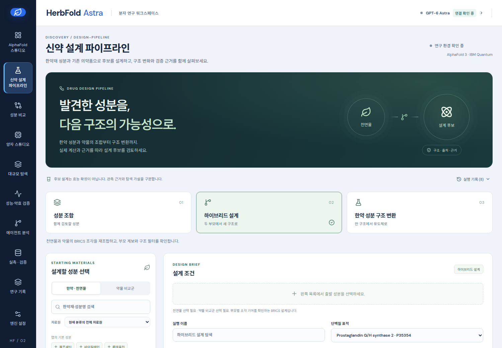
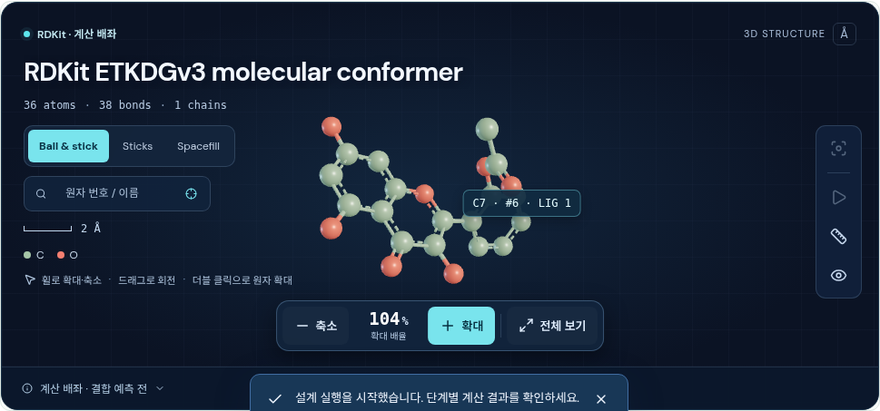

# 신약 설계 파이프라인

[현재 실행 화면](http://127.0.0.1:9018/#design-pipeline)에서 성분과 설계 방식을 선택한 뒤 **자동 설계 실행**을 누른다. 결과에서 원본·후보 구조를 비교하고 **3D 회전 · 확대**로 계산 배좌를 탐색한다. **실행 기록**으로 저장된 결과를 다시 열 수 있다. 인증을 사용하는 서버에서는 기존 **엔진 설정 → 로컬 API 인증 토큰 → 연결 상태 새로 고침**을 이용한다.

`#design-pipeline` 화면은 선택한 천연물·한약재 성분과 기존 의약품으로 계산 후보를 만들고, 부모 구조·물성 변화·현재 저장된 근거를 함께 확인하는 작업 공간이다. 생성 결과는 실험으로 확인한 의약품이나 처방이 아니다. 구조가 바뀌면 부모 물질의 assay 값을 새 후보의 관측값으로 옮기지 않는다.

## 세 가지 작업

| 모드 | 생성 단위 | 해석 |
| --- | --- | --- |
| `combination` | 서로 구분되는 성분들의 조합 | 각 성분의 구조와 근거를 보존한다. 혼합물을 하나의 공유결합 분자로 만들거나 단일 분자 물성을 부여하지 않는다. 배합비, 용량, 상승효과는 계산하지 않는다. |
| `hybrid` | 두 부모에서 BRICS 조각을 기여받은 분자 | 허용되는 조각 결합으로 구조를 열거한다. 부모별 기여가 확인되어야 하며 입력 부모와 같은 구조는 새 후보로 세지 않는다. 합성 가능성이나 약효 향상을 뜻하지 않는다. |
| `transform` | 선택한 변환을 적용한 유도체 | O-methylation, O-acetylation, 미지정 입체화학 열거를 사용한다. 적용 가능한 자리가 없으면 해당 변환의 생성 수가 0일 수 있다. |

천연물·한약재 분류는 입력의 출처 분류다. 같은 이름, 같은 지문 유사도, 부모 관계만으로 동일한 화학구조나 동일한 생물학적 근거라고 판단하지 않는다. 화학적 동일성은 현재 코드의 RDKit Cleanup + FragmentParent 후 canonical isomeric SMILES 기준이며 전하와 입체화학을 보존한다. 염의 다른 조각이 제거되는 경우 원입력과 표준화 정책을 함께 확인해야 한다.

## 실행과 근거

실행 요청은 이름, 모드, 성분 목록, 표적 accession, 최대 후보 수, 변환 목록, seed를 저장한다. 작업 ID로 진행 상태와 결과를 다시 읽을 수 있고, 실행 기록에서 이전 작업을 다시 열거나 진행 중인 작업에 취소를 요청할 수 있다. 후보를 구조 스튜디오에서 열 때는 그 후보의 실제 SMILES를 전달해야 한다.

물성은 생성된 구조에서 계산한다. 분자량, logP, TPSA, 수소결합 공여체·수용체 수, QED 및 필터 경고는 구조 계산 결과다. 물성 변화는 부모와의 같은 항목 차이이며 결합친화도, 혈중농도, 흡수율, 독성 또는 임상효능의 예측값으로 읽지 않는다. 입체이성질체가 같은 2차원 물성을 갖는 것은 정상이다.

저장된 assay 근거는 후보 자체의 표준화 구조와 해당 표적·endpoint에 맞는 경우에만 연결한다. `inactive` 라벨과 값 `0`은 결측값과 다르다. 이 경로는 기존 모델 점수를 관측값으로 불러오지 않는다. 조합의 각 성분에 있는 근거는 조합 전체의 약효·상승효과에 대한 근거가 아니다. 새 구조에 맞는 근거가 없으면 그 상태를 그대로 표시한다. Tox21 경로 라벨은 선택한 단백질 표적의 활성값과 별도로 표시한다.

관측값 입력은 저장소의 `validation/bio-validation/curated-records.json`과 `validation/tox21/curated-labels.jsonl`이다. 표적 관측값은 accession이 직접 기재되거나 현재의 PTGS2/KCNH2 매핑으로 accession을 확인할 수 있어야 한다. 생물학적 후보 예측 파일의 점수를 관측값으로 재분류하지 않는다. 결과에 사용된 근거 파일의 이름·SHA-256과 연결 범위가 남는다.

이 작업은 로컬 CPU 화학 구조 계산과 저장된 근거 연결로 구성한다. AF3 추론, QPU 측정, 외부 생물학적 예측 또는 새로운 assay 측정을 자동으로 제출하지 않는다. 따라서 화면의 예상 변화와 다음 검증 항목은 수치적 약효 예측과 구분한다.

별도의 병용 측정 비교는 사용자가 제공한 단독·병용 억제율에서 Bliss와 HSA 기준의 차이를 계산한다. 단독 억제율을 0–1 범위의 `a`, `b`라고 하면 Bliss 기대값은 `a + b - a*b`, HSA는 `max(a, b)`이고, 초과 억제율은 `100*(병용 관측값 - 기대값)` 퍼센트포인트다. 이 기준의 의미는 [SynergyFinder 2.0 원논문](https://academic.oup.com/nar/article/48/W1/W488/5815821)에 설명되어 있다. 코드가 입력 자료의 실측 여부를 확인하는 것은 아니며 각 행의 농도, 세포계, 노출 시간, endpoint, 정규화 조건이 일치해야 한다. 반복 측정 오차나 통계적 유의성은 계산하지 않는다.

## API

| 요청 | 용도 |
| --- | --- |
| `GET /api/design-pipeline/options` | 모드·변환 등 허용 옵션 |
| `POST /api/design-pipeline/runs` | 작업 생성 |
| `GET /api/design-pipeline/runs` | 저장된 작업 목록 (`items`) |
| `GET /api/design-pipeline/runs/{id}` | 한 작업의 현재 상태와 결과 |
| `POST /api/design-pipeline/runs/{id}/cancel` | 취소 요청 |
| `POST /api/design-pipeline/combination-assay` | 사용자 제공 단독·병용 억제율의 Bliss/HSA 산술 비교 |

입력 예시는 다음과 같다. SMILES는 실제 선택한 성분의 구조로 바꾼다.

```json
{
  "name": "Quercetin–aspirin structure exploration",
  "mode": "hybrid",
  "compounds": [
    {"id": "quercetin", "name": "Quercetin", "smiles": "O=c1c(O)c(-c2ccc(O)c(O)c2)oc2cc(O)cc(O)c12", "category": "herbal"},
    {"id": "aspirin", "name": "Aspirin", "smiles": "CC(=O)Oc1ccccc1C(=O)O", "category": "drug"}
  ],
  "target_accession": "P35354",
  "max_candidates": 12,
  "transformations": ["o_methylation", "o_acetylation", "stereoisomers"],
  "seed": 42
}
```

API 인증과 동일 출처 쓰기 정책은 기존 `/api/` 경로와 같다. 브라우저는 `frontend/src/lib/api.ts`를 통해 인증 헤더를 유지한다. 개발용 Vite 서버는 API를 `127.0.0.1:9018`로 전달한다. 배포 빌드는 `frontend`에서 `npm run build`를 실행하면 `src/herbfold/web`에 생성되며 FastAPI가 `/app/` 정적 파일을 제공한다.

한 runtime 디렉터리에는 서비스 프로세스 하나만 실행한다. `design-pipeline.lock`의 프로세스 수명 동안 유지되는 배타 잠금이 두 번째 서버의 소유권 획득을 거절한다. 첫 서버를 종료한 뒤 새 서버를 시작하면 미완료 설계 작업을 중단 상태로 복구한다. 여러 Uvicorn worker가 같은 runtime을 공유하는 구성은 지원하지 않는다. 아래 재시작 검증은 이전 프로세스를 종료한 후 같은 임시 저장소로 서버 하나를 다시 시작한 검사다.

## 검증 범위

`scripts/verify_design_pipeline.py`는 임시 저장소와 loopback 서버를 만들어 실제 API를 호출하는 통합 검사다. 원래 `runtime/` 데이터베이스를 사용하지 않으며, 기본 설정으로 작업을 생성하고 세 모드의 결과·재조회·재현성·취소 처리를 검사한다. assay 연결의 양성·음성 대조군은 별도 임시 파일에 기록된 합성 라벨임을 명시하고 운영 데이터에 넣지 않는다.

```bash
.venv/bin/python scripts/verify_design_pipeline.py --output tmp/design-pipeline-api-verification.json
node --test frontend/tests/*.test.mjs
```

통합 검사는 실행 계약과 화학적 일관성의 확인이다. 독립적인 약효 검증, 사용자 효율성 평가, 외부 소프트웨어 대비 우월성 평가가 아니다. 실행 결과와 한계는 검사 JSON에 남긴다. 브라우저에서 모드 전환, 입력 변경 후 오래된 결과 식별, 새로고침 후 복원, 작업 이력, 모바일 배치 및 생성 후보의 실제 구조 표시도 별도로 확인한다.

2026-09-17의 임시 저장소 API 실행에서는 quercetin·aspirin 입력으로 조합 1개, BRICS 후보 6개, 구조 변환 후보 6개를 얻었다. 같은 요청을 반복했을 때 후보 서명 해시가 같았고, 조합의 개별 성분 및 생성 구조의 물성 재계산이 일치했다. O-methylation·O-acetylation의 질량 증가와 공여체 수 감소, ibuprofen의 미지정 입체중심에서 생성한 서로 다른 2개 입체이성질체도 확인했다. 취소 후 결과 덮어쓰기 방지, 완료 결과의 재조회·서버 재시작 후 보존, 잘못된 구조의 저장 전 거절을 통과했다. 같은 저장소를 열려는 두 번째 실제 서버는 소유권 잠금으로 거절되었으며 첫 서버의 완료 결과가 바뀌지 않았다.

합성 assay 대조군에서는 부모의 관측값이 새 구조에 전파되지 않았고, 다른 표적 선택 시 PTGS2 값이 연결되지 않았다. 비활성 라벨 `0` 및 유효한 pactivity `0`은 보존되었다. 병용 산술 대조군은 Bliss 기대값 0.44, 초과값 16 퍼센트포인트 및 HSA 초과값 30 퍼센트포인트를 확인했다. 일치 조건 확인값은 JSON boolean `true`만 허용했고 숫자 `1`, `1.0`, 문자열 `"true"`는 거절했다. 이 수치는 합성 입력의 산술 결과이며 생물학적 측정 결과가 아니다. 최종 실행 영수증과 소스 해시는 [API 검증 JSON](drug-design-pipeline-api-verification.json)에 있다. 작업용 원본은 `tmp/design_pipeline_20260917/isolated-api-verification.json`에 있다.


최종 회귀 검사에서 Python 813개, 프런트엔드 57개가 통과했으며 TypeScript·Vite 빌드와 Ruff 검사도 통과했다. 격리된 Chrome UI 검사에서 실제 세 모드 실행, 2D 그래프, WebGL 분자 회전·확대, SDF·JSON 다운로드, 같은 실행 기록 재선택, 새로고침 후 결과 복원, 390px 모바일 배치와 AF3 스튜디오 전달을 확인했다. JavaScript 오류는 없었다. 병용 폼에는 명시적으로 합성 산술 대조군을 사용했으며 운영 자료로 저장하지 않았다.

운영 서버 9018에서도 인증 갱신 후 설정·자료원 조회가 복구되고, 황금 검색의 실제 342개 일치 구조를 확인했다. 운영 자료로 실행한 기능 확인 기록은 조합 1개·하이브리드 4개·구조 변환 4개이며 각 실행의 외부 계산 호출은 0회다. 사용자는 **실행 기록 → 기능 확인**에서 이 결과를 살펴볼 수 있다. [브라우저·운영 연결 검증 JSON](drug-design-pipeline-ui-verification.json)에 실행 ID와 소스 해시가 있다.




