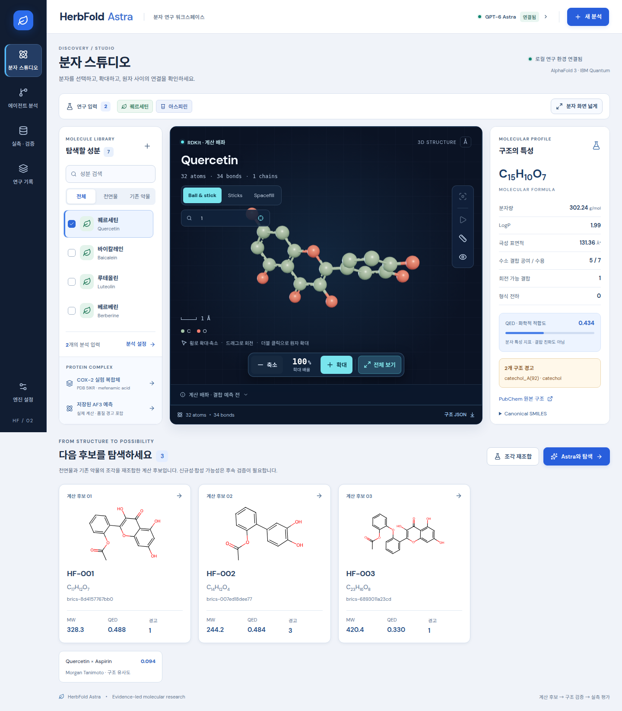

# 분자 스튜디오 가독성 개선과 줌 조작 검증

2026-09-07 사용자 요청에 따라 분자 스튜디오의 화면 가시성과 확대·축소 조작을 개선했다. 기존의 흐린 녹색 화면을 흰색·슬레이트·파란색의 연구 화면과 남색 분자 뷰어로 바꾸고, 글자와 조작 버튼을 키웠다. Motion·GSAP·Three.js·React Three Fiber·Drei를 사용했다.

## 기존 화면에서 확인한 문제

`docs/images/astra-studio.png`와 프론트엔드 코드를 함께 확인했다. 주요 보조 설명이 8–10 px이고 회색을 섞은 연두색 글자를 밝은 배경 위에 사용해 실제 수치와 설명이 쉽게 묻혔다. 선택 상태도 밝은 녹색들 사이의 작은 차이에 의존했다. 분석 입력 선택 버튼은 14×14 px, 뷰어 줌 버튼은 약 31×30 px여서 조작하기 어려웠다.

기존 CSS 색상을 기준으로 계산한 명도 대비는 `#879181`/`#fffefa`가 3.25:1, `#97a08b`/`#fffefa`가 2.70:1, `#9da68e`/`#fffefa`가 2.51:1이었다. 배경 합성 효과를 제외한 정적 색상 비교이며, 새 화면은 브라우저 캡처와 실제 계산된 스타일을 별도로 확인한다.

기존 OrbitControls의 일반 휠 확대가 꺼져 있고 Alt+휠만 별도로 처리되었다. 화면 오른쪽 작은 아이콘 외에는 확대 방법을 쉽게 발견하기 어려웠다. 페이지를 확대하거나 브라우저 창을 줄이면 3열 레이아웃과 뷰어의 절대 위치 패널이 경쟁하기 때문에 다양한 너비에서 확인해야 한다.

## 개선 기준

- 흰색·슬레이트·파란색의 명확한 대비를 사용하고 핵심 설명과 숫자는 읽기 쉬운 크기로 표시한다. 선택 상태에는 색 외에 테두리·아이콘·텍스트 및 접근성 상태를 함께 제공한다.
- 분자 뷰어 안에서는 일반 휠과 두 손가락 조작으로 확대·축소하고, 화면에 확대·축소·전체 맞춤 버튼과 실제 카메라 거리에서 계산한 배율을 표시한다. 뷰어 바깥의 페이지 스크롤은 유지한다.
- 키보드로 3D 화면에 접근한 뒤 `+`, `-`, `0`으로 확대·축소·전체 맞춤을 실행할 수 있게 한다. 원자 검색, 결합 정보와 거리 측정 기능을 유지한다.
- Motion은 상태 전환, GSAP는 카메라 이동에 사용하고 Three.js·React Three Fiber·Drei는 실제 분자 좌표와 결합을 렌더링한다. 렌더링은 정지 시 demand 모드를 유지한다.
- `prefers-reduced-motion`에서 자동 회전을 비활성화하고 카메라 이동을 즉시 완료한다. 대화상자의 키보드 포커스 제한, Escape 닫기, 이전 버튼으로 포커스 복귀를 유지한다.
- RDKit 계산 배치·AlphaFold 3 예측·실험 구조의 출처, 단위와 품질 경고는 디자인 변경 후에도 유지한다.

## 검증 방법

`scripts/verify_studio_redesign.py`는 실행 중인 로컬 서버에 접속해 실제 카메라 거리가 버튼·일반 휠·키보드 조작 방향에 맞게 변하는지 확인한다. 줌 버튼이 클릭됐다는 사실만으로 성공을 판단하지 않는다. 전체 맞춤은 원래 거리를 복원해야 하며, 뷰어 위의 휠은 페이지 위치를 바꾸지 않고 바깥의 휠은 페이지를 스크롤해야 한다.

이 스크립트는 원자 선택, 결합 정보, 2원자 거리 표시, 표현 방식 변경, 모션 감소 설정, 분석 대화상자의 포커스, 1440·1024·768·390·360 px 너비에서의 가로 넘침과 줌 버튼 크기도 확인한다. 새 분석·AF3·IBM Quantum 작업의 POST 요청은 테스트 중 차단하며, 로컬 분자 표시만 수행한다.

```bash
python scripts/verify_studio_redesign.py --url http://127.0.0.1:8873
```

검증 결과와 화면 캡처는 `tmp/studio-redesign-verification.json` 및 `tmp/studio-redesign-1440.png`, `tmp/studio-redesign-390.png`에 저장된다. 자동 검사는 이 조작과 레이아웃 범위의 증거이며 전체 접근성 적합성 인증을 뜻하지 않는다. 두 손가락 조작은 Chrome의 실제 터치 이벤트를 에뮬레이션해 검증했으며 물리 휴대전화 검증과는 구분한다.

## 최종 배포 빌드 확인 결과

`http://127.0.0.1:8873`의 `index-DoL929kB.js`, `index-BfjcbYeQ.css`, `MoleculeViewer-DTStmNdW.css` 빌드에서 검증을 통과했다. 재현 가능한 측정값과 해당 빌드의 SHA-256은 [검증 JSON](studio-redesign-verification.json)에 저장했다.

| 확인한 기능 | 실제 결과 |
| --- | --- |
| 확대·축소 버튼 | 카메라–초점 거리 25.8735 → 20.6988 → 25.8735 Å |
| 일반 마우스 휠 | 거리 25.8735 → 24.8333 → 25.8735 Å, 페이지 위치 유지 |
| 키보드 `+`, `-`, `0` | 확대·축소와 전체 맞춤 복원 확인 |
| Chrome 두 손가락 핀치 | 거리 51.7416 → 29.7177 Å로 확대 |
| 원자·결합 정보 및 측정 | 원자 0·1을 선택해 1.398 Å 표시 |
| 넓은 분자 화면 | 1440 px 화면에서 뷰어 폭 724 → 1276 px, 패널 복원 확인 |
| 좁은 화면 | 360·390·768·1024·1440 px에서 가로 넘침 없음, 줌 바와 버튼 잘림 없음 |
| 모바일 줌 버튼 | 390 px에서 약 58×48 px, 360 px에서 약 48×48 px |
| 모션 감소·키보드 포커스 | 자동 회전 비활성화, 대화상자 포커스 제한·Escape·복귀 통과 |
| 페이지별 레이아웃 | 분자·에이전트·실측·기록 화면을 1440·390 px에서 확인 |

브라우저의 계산된 색상으로 확인한 명도 대비는 페이지 설명 5.43:1, 성분 영문명 4.65:1, 물성 레이블 5.68:1, 구조 출처 설명 4.76:1, 기본 분석 버튼 5.64:1이었다. 뷰어 색상 비교는 배경 그라데이션을 제외한 기본 배경색 기준이다.

검증 중 원자 정보 창이 도구 막대를 덮는 문제와 360 px 화면에서 줌 버튼 문구가 잘리는 문제를 발견해 수정하고 다시 확인했다. 최종 확인에서 JavaScript 오류가 없었고, 새 분석·LLM 생성·AF3·IBM Quantum 작업을 제출하지 않았다.



[모바일 분자 뷰어 화면](images/studio-redesign-mobile.png)
